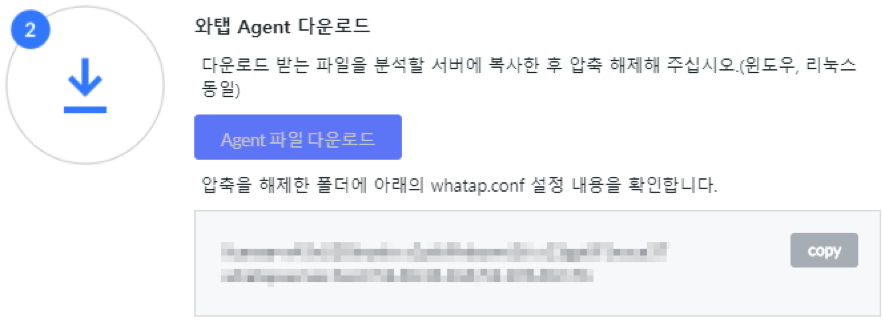
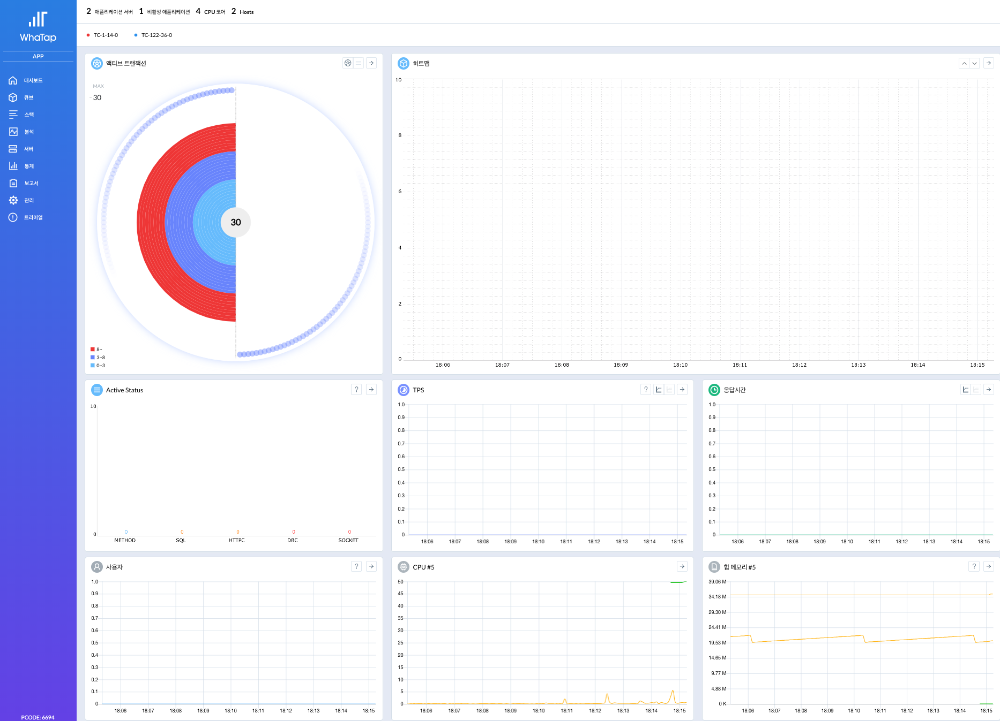

# Java

## 모니터링 에이전트 개요

와탭 Java 애플리케이션 모니터링 은 Java 기반 웹 애플리케이션 서버 모니터링 서비스를 제공합니다.

## **에이전트 설치 방식 개요**

와탭은 사용자 편의를 위해 2가지 방식의 에이전트 설치 방식을 제공합니다.

사용자 환경에 따라 **javaagent**, **javaagent+onetime attach** 방식 중 택일하여 에이전트를 설치 할 수 있습니다.

> 와탭은 애플리케이션 서버 기동 상태에서 최초 설치 시에는 attach 방식을 활용하고 재기동 이후 “javaagent” 방식을 활용하는 “javaagent+onetime attach” 방식을 권장합니다.


attach 방식은 com.sun.tools.attach.VirtualMachine API를 활용하므로 Java6 이상에서 동작합니다.  
IBM JDK 의 경우 attach 방식에서 트랜잭션 정보가 수집되지 않는 제약이 있습니다.


### **javaagent + onetime attach 방식**

애플리케이션 서버 기동시에 성능 데이터 수집을 위한 모듈을 주입하는 방식과 실행 중인 애플리케이션 서버에 모듈을 주입하는 방식을 혼용하는 방식입니다.

“javaagent” 방식과 동일한 설정을 실행중인 애플리케이션 서버의 실행 스크립트에 추가하여 애플리케이션 서버 재기동 시에도 모니터링 기능이 유지되도록 설정함과 동시에, 실행 중인 애플리케이션 서버에도 모니터링 기능을 활성화 합니다. attach.sh가 일회성으로 애플리케이션 서버 프로세스를 식별하고 Tracer를 활성화 합니다.

> 애플리케이션 서버 재기동에 민감한 환경에 APM 모니터링을 적용할 경우 유용한 방식이며, 애플리케이션 서버 재기동 이후에는 와탭의 권장 방식으로 모니터링이 수행되는 방식입니다.


**javaagent + onetime attach 적용법**

1. 애플리케이션 서버 실행 스크립트에 JVM 옵션으로 -javaagent 옵션에 Tracer의 파일 경로를 추가합니다.
2. attach.sh을 실행하여 실행 중인 애플리케이션 서버에 Tracer를 활성화시킵니다.

### **javaagent 방식**

애플리케이션 서버 부팅 시에 성능 데이터 수집을 위한 모듈을 주입하는 방식입니다.


**javaagent 적용법**

1. 애플리케이션 서버 실행 스크립트에 JVM 옵션으로 -javaagent 옵션에 Tracer의 파일 경로를 추가합니다.
2. 애플리케이션 서버를 재기동 시 Tracer 가 애플리케이션 서버의 하위 프로세스로 실행되어 성능 수집 코드를 주입합니다.
3. Tracer: 성능 데이터 수집을 위한 모듈

## **구성 파일**

와탭 모니터링 에이전트는 모니터링 정보를 수집하여 서버에 전송하기 위한 Tracer 와 watcher 방식 활용 시 Tracer를 애플리케이션에 attach하기 위한 Watcher 및 에이전트를 디버깅하기 위한 쉘 스크립트 파일로 구성됩니다.

와탭 모니터링 에이전트를 구성하는 각 파일의 역할은 다음과 같습니다.

### **공통 구성 파일**

| 파일명 | 설명 |
| :--- | :--- |
| whatap.agent.tracer-\#.\#.\#.jar | Tracer - 웹 애플리케이션 서버 프로세스에 Attach되어 정보를 수집/서버로 전송하는 프로그램 |
| whatap.conf | 애플리케이션 서버의 데이터를 수집하는 수집서버의 주소와 서버의 프로젝트 라이선스 키가 입력되는 파일 |

### **javaagent + onetime attach 실행 파일**

| 파일명 | 설명 |
| :--- | :--- |
| attach.sh\(bat\) | 실행 중인 애플리케이션 서버에 일회성으로 Tracer를 적용하기 위한 리눅스\(Windows\)계열 OS용 실행 쉘스크립트 |

### **유틸리티 구성 파일**

| 파일명 | 설명 |
| :--- | :--- |
| javaproc.sh\(bat\) | 실행중인 자바 프로세스들의 PID와 JVM 옵션을 확인하는 리눅스\(Windows\)계열 OS용 실행 쉘스크립트 |
| resmon.sh\(bat\) | CPU/Memory/Disk 정보 추출을 위한 리눅스\(Windows\)계열 OS용 실행 쉘스크립트 |
| proxy.conf | 소프트웨어 프록시 설정 파일 |
| proxy.sh\(bat\) | 소프트웨어 프록시 실행을 위한 리눅스\(Windows\)계열 OS용 실행 쉘스크립트 |
| ping.sh\(bat\) | 서버와의 통신 확인을 위한 위한 리눅스\(Windows\)계열 OS용 실행 쉘스크립트 |

## **에이전트 이름 식별**

와탭은 모니터링 정보 수집 대상인 애플리케이션 서버 식별을 위한 정보로 기본적으로 애플리케이션 서버로부터 수집한 정보를 활용합니다. 기본적으로 활용하는 정보는 애플리케이션 서버 종류, 애플리케이션 서버의 IP, 서비스 포트를 조합하여 애플리케이션 서버를 고유 식별자로 사용하게 되며 필요에 따라 사용자가 지정한 명칭을 사용하거나 패턴을 변경하여 사용하는 것도 가능합니다. 이때에는 꼭 고유한 값이어야만 합니다. 애플리케이션 서버로부터 추출한 정보를 활용하는 이유는 애플리케이션 서버의 정지, 단절 또는 에이전트 문제로 인한 수집 서버와 에이전트의 통신 단절 상태가 복구되었을 경우, 재 접속된 에이전트로부터 송신되는 정보가 기존 에이전트로부터 송신된 정보와의 연속성을 유지하기 위해서입니다. 와탭이 애플리케이션 서버를 식별하기 위해 사용하는 기본 패턴은 다음과 같습니다.

* default: {type}-{ip2}-{ip3}-{port}
* 마지막 요소가 {port}가 아닌 {pid}로 나올 경우 애플리케이션 서버의 서비스 포트가 인식되지 않은 것으로 애플리케이션의 마지막 항목에 표시되는 PID\(프로세스 ID\)를 참고하여 설치 문제에 대응합니다.

## 에이전트 설치/실행/업데이트/중지 {#user-content-에이전트-설치-실행-업데이트-중지}

와탭 APM 모니터링 서비스를 사용하기 위해서는 모니터링 대상 애플리케이션 서버에 와탭 APM 모니터링 에이전트를 설치해야 합니다.  
와탭 APM 모니터링 에이전트 설치 방법은 whatap.io 사이트에서 압축된 에이전트 파일을 다운로드 받아 서버 임의의 위치에 압축을 풀어 실행하는 것만으로 설치가 완료됩니다.

### **공통**

#### **프로젝트 생성**


서버를 등록하기 위해 우선 프로젝트를 생성합니다. 추가 버튼을 선택하면 아래와 같이 프로젝트 생성 창이 나타납니다. JAVA 아이콘을 선택한 뒤, 희망하는 프로젝트명과 데이터 서버 지역\(Region\), 소속하게 될 그룹을 선택한 뒤 프로젝트를 생성합니다.


#### **라이선스 발급**


프로젝트 관리화면에서는 우선적으로 라이선스를 발급 받습니다. 라이선스 키는 프로젝트별로 귀속되기 때문에, 유출되거나 배포 되어서는 안됩니다. 반드시 본인 프로젝트에 서버를 등록할 때에만 이용하시기 바랍니다.

#### **에이전트 다운로드**



라이선스를 발급 받은 후에는 ‘에이전트 파일 다운로드’ 버튼이 활성화 되었음을 확인할 수 있습니다. 해당 버튼을 눌러 와탭 에이전트 파일을 다운로드 받습니다.

다운로드가 완료되면 안에 있는 whatap.conf 파일의 설정을 확인하여 라이선스키와 데이터 수집 서버 주소가 정상적으로 들어가 있는지를 확인합니다.

```text
license={라이선스 키}
whatap.server.host={수집서버 정보}
```

* wget으로 직접 다운 받을 경우, whatap.conf 파일에 라이선스키와 데이터 수집 서버 주소가 정상적으로 들어가지 않습니다. 해당 방식으로 다운 받을 경우, 업로드 후 별도로 라이선스키와 데이터 수집 서버 주소를 넣어주시기 바랍니다.

#### **에이전트 업로드**

애플리케이션 서버가 설치된 서버에 접속하고, 다운로드 받은 에이전트 파일을 업로드 한 후, 압축해제를 합니다.

* $WHATAP\_HOME은 와탭 APM 모니터링 에이전트의 설치 경로를 가리키며, 이후 본 문서에서 이와 같이 기술합니다.
* 에이전트는 수집 서버 주소로 애플리케이션 서버의 성능 정보를 전송합니다. 그러므로 방화벽에 수집 서버 IP로의 TCP 아웃바운드 포트 \(6600\)이 차단되어 있으면 안됩니다.

#### **자원 수집 가능 여부 확인**

$WHATAP\_HOME 경로로 이동하여 CPU/Memory/Disk 정보 추출 가능 여부를 확인합니다.

```text
$ ./resmon.sh
_      ____       ______
| | /| / / /  ___ /_  __/__ ____
| |/ |/ / _ \/ _ `// / / _ `/ _ \
|__/|__/_//_/\_,_//_/  \_,_/ .__/
                              /_/
Just Tap, Always Monitoring
WhaTap Agent version 0.3.7 20161107
cpu      pcpu    mem     disk
120322 14.06    0.0     42.0    85.0
120325 14.06    0.0     42.0    85.0
```

이후 절차는 각각의 설치 방식에 따라 진행하면 됩니다.

* 진행되는 절차가 상이하여 다른 작업 방식을 적용할 경우 에이전트가 정상적으로 작동되지 않을 수 있으니 반드시 본 매뉴얼을 참고해주시기 바랍니다.

### **javaagent + onetime attach 방식**

실행 중 애플리케이션 서버에는 attach 방식으로 모니터링 기능을 적용하고, 애플리케이션 서버의 재기동 시점에 “javaagent” 방식을 적용합니다. 실행 상태의 애플리케이션 서버를 재기동 하지 않고 모니터링을 수행하고, 애플리케이션 서버 재기동 시에는 권장 설치 방식으로 모니터링 기능을 적용합니다.

* 본 방식은 attach.sh\(bat\) 파일을 실행하여 적용하며, 실행 파라미터로 PID\(프로세스 ID\)를 사용합니다.
* 최초 실행 시 attach.sh\(bat\)를 실행하는 과정을 제외하고 설치/실행/업데이트/종료 절차는 ‘javaagent’ 방식과 동일합니다.

#### **사전 확인**

Linux 계열의 경우 ps 명령을, Windows 계열의 경우 작업관리자를 통해 실행 중인 애플리케이션의 프로세스ID \(PID\)를 확인합니다.Tomcat 예시\(Linux, Web Application Server 종류별로 상이할 수 있습니다\)

```text
$ ps -ef | grep tomcat | grep -v 'grep'
ec2-user  3058     1  1 06:11 pts/0    00:00:02 /home/ec2-user/jdk1.8.0_111/bin/java -Djava.util.logging.config.file=/home/ec2-user/apache-tomcat-7.0.72/conf/logging.properties -Djava.util.logging.manager=org.apache.juli.ClassLoaderLogManager -Djdk.tls.ephemeralDHKeySize=2048 -Djava.endorsed.dirs=/home/ec2-user/apache-tomcat-7.0.72/endorsed -classpath /home/ec2-user/apache-tomcat-7.0.72/bin/bootstrap.jar:/home/ec2-user/apache-tomcat-7.0.72/bin/tomcat-juli.jar -Dcatalina.base=/home/ec2-user/apache-tomcat-7.0.72 -Dcatalina.home=/home/ec2-user/apache-tomcat-7.0.72 -Djava.io.tmpdir=/home/ec2-user/apache-tomcat-7.0.72/temp org.apache.catalina.startup.Bootstrap start
```

#### **설치**

“javaagent” 방식의 설치와 동일하게 애플리케이션 서버 JVM 옵션에 -javaagent 설정을 추가합니다.

```text
-javaagent:$WHATAP_HOME/whatap.agent.tracer-#.#.#.jar
```

#### **실행**

$WHATAP\_HOME 경로 하위에서 사전 확인 과정에서 확인한 PID를 파라미터로 부여하여 attach.sh\(bat\)을 실행합니다. 에이전트 정상 동작 확인 절차는 “javaagent” 방식과 동일합니다.

```text
$ ./attach.sh 3058
JAVA_HOME=/jdk1.8.0_111
_      ____       ______
| | /| / / /  ___ /_  __/__ ____
| |/ |/ / _ \/ _ `// / / _ `/ _ \
|__/|__/_//_/\_,_//_/  \_,_/ .__/
                         /_/
Just Tap, Always Monitoring
WhaTap Agent version 0.4.2 20161123
Admin: ec2-user
PID: 3128
Java Path: /jdk1.8.0_111/jre
Java Version: 1.8.0_111
AttachAgent Success :  [3058] org.apache.catalina.startup.Bootstrap start
```

### **javaagent 방식**

본 방식으로 에이전트를 구동하는 경우 해당 애플리케이션 서버의 재부팅을 필요로 합니다.

#### **설치**

애플리케이션 서버 JVM 옵션에 -javaagent 설정을 추가합니다.

```text
-javaagent:$WHATAP_HOME/whatap.agent.tracer-#.#.#.jar
-javaagent 프로퍼티 값은 $WHATAP_HOME/whatap.agent.tracer-#.#.#.jar의  절대 경로입니다. 애플리케이션 서버에 따라 별도의 프로퍼티를 추가해야 하는 경우도 있으며, 이는 ‘애플리케이션 서버 별 적용 절차’에서 확인할 수 있습니다.
```

#### **Tomcat – Linux 계열**

Tomcat의 경우 웹 애플리케이션 서버를 구동하는 파일\(톰캣의 경우 Catalina\)의 상단에 JAVA\_OPTS를 부여합니다.

```text
#   JAVA_OPTS       (Optional) Java runtime options used when any command
#         is executed.
#         Include here and not in CATALINA_OPTS all options, that
#         should be used by Tomcat and also by the stop process,
#         the version command etc.
#         Most options should go into CATALINA_OPTS.
########## WHATAP ############
JAVA_OPTS="${JAVA_OPTS} -javaagent:/whatap/whatap.agent.tracer-0.4.2.jar "
########## WHATAP ############
```

항상 $WHATAP\_HOME 디렉토리에 설치된 최상위 버전의 에이전트로 기동하고자 하는 경우, 아래와 같은 스크립트를 적용해줍니다.

```text
WHATAP_HOME=/whatap
########## WHATAP ############
WHATAP_JAR=`ls ${WHATAP_HOME}/whatap.agent.tracer-*.jar | sort | tail -1`
JAVA_OPTS="${JAVA_OPTS} -javaagent:${WHATAP_JAR} "
########## WHATAP ############
```

#### **Tomcat – Windows 계열**

```text
rem   JAVA_OPTS       (Optional) Java runtime options used when any command
rem         is executed.
rem         Include here and not in CATALINA_OPTS all options, that
rem         should be used by Tomcat and also by the stop process,
rem         the version command etc.
rem         Most options should go into CATALINA_OPTS.
rem ########## WHATAP ############
if x%JAVA_OPTS:whatap=%==x%JAVA_OPTS% (
  set JAVA_OPTS=%JAVA_OPTS% -javaagent:C:\whatap\whatap.agent.tracer-0.4.2.jar
)
rem ########## WHATAP ############
```

항상 $WHATAP\_HOME 디렉토리에 설치된 최상위 버전의 에이전트로 기동하고자 하는 경우, 아래와 같은 스크립트를 적용해줍니다.

```text
rem ########## WHATAP ############
set WHATAP_HOME=C:\whatap
for /f %%f in ('dir /b /on %WHATAP_HOME%\whatap.agent.tracer-*.jar') do set last=%%f
set WHATAP_JAR=%last%
if x%JAVA_OPTS:whatap=%==x%JAVA_OPTS% (
  set JAVA_OPTS=%JAVA_OPTS% -javaagent:%WHATAP_HOME%\%WHATAP_JAR%
)
rem ########## WHATAP ############
```

### **실행**

애플리케이션 서버를 기동 또는 재기동 하고, 애플리케이션 서버 로그 및 에이전트 로그를 확인하여 에이전트의 정상 기동 여부를 확인합니다.

```text
Nov 16, 2016 3:06:40 AM org.apache.catalina.startup.HostConfig deployDirectory
INFO: Deployment of web application directory /var/lib/tomcat7/webapps/ROOT has finished in 577 ms
Nov 16, 2016 3:06:40 AM org.apache.coyote.AbstractProtocol start
INFO: Starting ProtocolHandler ["http-bio-8080"]
Nov 16, 2016 3:06:40 AM org.apache.catalina.startup.Catalina start
INFO: Server startup in 3984 ms
_       ____       ______
| | /| / / /  ___ /_  __/__ ____
| |/ |/ / _ \/ _ `// / / _ `/ _ \
|__/|__/_//_/\_,_//_/  \_,_/ .__/
                         /_/
Just Tap, Always Monitoring
WhaTap Agent version 0.3.9 20161115
```

서버에서 정상적으로 로그가 올라온 것을 확인한 뒤, 콘솔에 정상적으로 등록되어 있는 여부를 확인하기 위해 해당 프로젝트의 ‘서버’ 메뉴에 올라온 해당 애플리케이션 서버의 명칭을 확인합니다.


* 애플리케이션명은 {type}-{ip2}-{ip3}-{port\] 의 형태의 식별ID가 부여됩니다. 마지막 요소가 {port}가 아닌 {pid}인 경우 애플리케이션 서버의 서비스 포트가 인식되지 않은 것으로 애플리케이션의 마지막 항목에 표시되는 PID\(프로세스 ID\)를 참조하여 설치 문제에 대응합니다.

### **업데이트**

에이전트 설치 파일을 다운로드 받아 압축을 풀고, whatap.agent.tracer-..\#.jar 파일을 $WHATAP\_HOME폴더에 복사합니다.

애플리케이션 서버의 JVM 옵션의 -javaagent 설정을 새로 설치된 whatap.agent.tracer-..\#.jar로 수정하고, 애플리케이션 서버를 재기동 합니다.

* 애플리케이션 서버 재기동 시 항상 최상위 버전으로 적용하고자 하는 경우 위 ‘설치’ 섹션에서 제시된 스크립트를 참조하여 적용하면 됩니다.
* 구 버전의 whatap.agent.tracer-..\#.jar 파일을 삭제하고자 하는 경우, 애플리케이션 서버 재기동 이후에 삭제하도록 합니다.

### **중지**

애플리케이션 서버 JVM 옵션의 -javaagent 설정을 삭제하고, 애플리케이션 서버를 재기동 합니다.

* 에이전트 삭제를 희망하는 경우, 애플리케이션 서버 재기동 이후에 삭제하도록 합니다.

## 로그 \(준비 중\) {#user-content-로그-준비-중}

### **로그파일 종류**

### **정상 동작 확인**

## 애플리케이션 서버 별 적용절차 {#user-content-애플리케이션-서버-별-적용절차}

### **애플리케이션 서버 별 JVM 옵션 설정 위치**

| 애플리케이션 서버 | 설정 위치 |
| :--- | :--- |
| SpringBoot | java -javaagent:{whatap.agent.tracer-x.x.x.jar의 full path} -jar {application jar} |
| Tomcat | $CATALINA\_HOME/bin/catalina.sh\(bat\) |
| JBoss 5.0 이하 | $JBOSS\_HOME/bin/run.conf |
| JBoss 7.0 이상 EAP 6.0이상 | $JBOSS\_HOME/bin/standalone.conf\(domain.conf\) |
| WebLogic | $WEBLOGIC\_HOME/user\_projects/domains/사용자도메인/bin/startWebLogic.sh\(bat\) |
| WebSphere | Admin console 사용 |
| Jeus7 | $JEUS\_HOME/domains/jeus\_domain/config.xml |
| Jeus6 | $JEUS\_HOME/config/$hostname/JEUSMain.xml |
| Jetty | watch\_jetty.sh\(bat\) |
| play2 | $PLAY\_HOME/framework/build |

### **SpringBoot**

jar 형태로 패키징하여 실행하는 경우 jvm 옵션에 -javaagent를 추가합니다.

```text
java -javaagent:{whatap.agent.tracer-x.x.x.jar의 full path} -jar {application jar}
```

### **Tomcat on Windows Service**

Windows 계열 OS에 binary로 설치하여 SYSTEM 계정으로 실행한 경우, ‘javaagent’ 방식으로 Tomcat을 실행합니다.

* “Configure Tomcat” 프로그램을 실행하여 Java 탭 선택 &gt; Java Options에 -javaagent 옵션을 지정합니다.


### **JBoss**

#### **javaagent + onetime attach 방식**

1.javaagent 방식과 동일하게 JVM 옵션을 추가합니다.

standalone.sh 설정 추가 예

```text
#!/bin/sh
########## WHATAP ############
WHATAP_HOME=/home/ec2-user/whatap
WHATAP_JAR=`ls ${WHATAP_HOME}/whatap.agent.tracer-*.jar | sort | tail -1`
JAVA_OPTS="${JAVA_OPTS} -javaagent:${WHATAP_JAR} -Djboss.modules.system.pkgs=whatap "
########## WHATAP ############
```

2. JBOSS의 PID\(프로세스 ID\)를 확인합니다.

```text
$ ps -ef | grep jboss | grep -v 'grep'
ec2-user 27757 27714 13 12:21 pts/2    00:00:03 /jdk1.7.0_79/bin/java -D[Standalone] -server -XX:+UseCompressedOops -XX:+TieredCompilation -Djboss.modules.system.pkgs=whatap -Dorg.jboss.boot.log.file=/jboss-as-7.1.1.Final/standalone/log/boot.log -Dlogging.configuration=file:/jboss-as-7.1.1.Final/standalone/configuration/logging.properties -jar /jboss-as-7.1.1.Final/jboss-modules.jar -mp /jboss-as-7.1.1.Final/modules -jaxpmodule javax.xml.jaxp-provider org.jboss.as.standalone -Djboss.home.dir=/jboss-as-7.1.1.Final
```

3. attach.sh 스크립트를 실행합니다.

```text
$ ./attach.sh 27757
JAVA_HOME=/jdk1.7.0_79
_      ____       ______
| | /| / / /  ___ /_  __/__ ____
| |/ |/ / _ \/ _ `// / / _ `/ _ \
|__/|__/_//_/\_,_//_/  \_,_/ .__/
                         /_/
Just Tap, Always Monitoring
WhaTap Agent version 0.4.5 20161207
Admin: ec2-user
PID: 27848
Java Path: /jdk1.7.0_79/jre
Java Version: 1.7.0_79
AttachAgent Success :  [27757] /jboss-as-7.1.1.Final/jboss-modules.jar -mp /jboss-as-7.1.1.Final/modules -jaxpmodule javax.xml.jaxp-provider org.jboss.as.standalone -Djboss.home.dir=/jboss-as-7.1.1.Final
```

#### **javaagent 방식**

1.JVM 옵션에 -javaagent 및 -Djboss.modules.system.pkgs에 설정을 추가합니다.

| 애플리케이션 서버 버전 | JVM 옵션 |
| :--- | :--- |
| 공통 | JVM 옵션의 -javaagent에 Tracer 설정 |
| JBOSS 7.0 이상 EAP 6.0이상 | JVM 옵션의 -Djboss.modules.system.pkgs 환경 변수에 “whatap” prefix 추가 |

2. standalone.sh 설정 추가 예

```text
#!/bin/sh
########## WHATAP ############
WHATAP_HOME=/home/ec2-user/whatap
WHATAP_JAR=`ls ${WHATAP_HOME}/whatap.agent.tracer-*.jar | sort | tail -1`
JAVA_OPTS="${JAVA_OPTS} -javaagent:${WHATAP_JAR} -Djboss.modules.system.pkgs=whatap "
########## WHATAP ############
```

3. “-Djboss.modules.system.pkgs=whatap” 미설정 시 에러 메세지

```text
11:38:46,148 ERROR [org.apache.catalina.core.ContainerBase.[jboss.web].[default-host].[/].[default]] (http--0.0.0.0-8080-1) Servlet.service() for servlet default threw exception: java.lang.ClassNotFoundException: whatap.agent.trace.TraceMain from [Module "javax.servlet.api:main" from local module loader @67d7d474 (roots: /jboss-as-7.1.1.Final/modules)]
```

### **WebLogic**

1.javaagnet 방식 적용 시의 설정 예시를 제시합니다.

설정 위치  
$WEBLOGIC\_HOME/user\_projects/domains/사용자도메인/bin/startWebLogic.sh\(bat\)

2. javaagent 프로퍼티 설정을 추가합니다.

* $WEBLOGIC\_HOME은 WebLogic 설치 경로를 가리킵니다.


### **WebSphere**

에이전트 방식만 지원하며, Web Console을 통한 설정 방법을 제시합니다.

1.먼저 웹브라우저를 통해 admin console에 로그인 합니다.


2. Servers &gt; Server Type &gt; WebSphere application servers 메뉴를 통해 에이전트를 설치할 서버를 선택합니다.


3. 선택된 서버 Configuration 탭에 Server Infrastructure의 Java and Process Management - Process definition 메뉴를 선택합니다.


4. Additional Properties의 Java Virtual Machine 메뉴를 선택합니다.


5. WEBSHERE의 서비스 포트를 확인합니다.


6. Configuration 탭의 Generic JVM arguments에 -javaagent와 -Dwhatap.port를 추가합니다.


#### **리눅스 계열**

> -javaagent:/home/wasadmin/whatap/whatap.agent.tracer-\#.\#.\#.jar -Dwhatap.port=9443

#### **윈도우 계열**

> -javaagent:C:\whatap\whatap.agent.tracer-\#.\#.\#.jar -Dwhatap.port=9443

### **Jeus**

‘javaagent’ 방식을 적용하는 경우, 다음 절차를 통해 설치합니다.

1.Jeus 설정 파일에서 JVM 옵션을 설정합니다

|  | 설정 파일 위치 |
| :--- | :--- |
| Jeus7 | $JEUS\_HOME/domains/jeus\_domain/config.xml 에서 jvm-option에 -javaagent 옵션을 추가합니다. |
| Jeus6 | $JEUS\_HOME/config/$hostname/JEUSMain.xml 에서 command-option에 -javaagent 옵션을 추가합니다. |

* $JEUS\_HOME은 JEUS 설치 경로를 가리킵니다.



```text
<domain>
   <servers>
       <server>
           <name>server1</name>
           <jvm-config>
               <jvm-option>
                   -Xmx1024m -XX:MaxPermSize=128m
                   -javaagent:/whatap/whatap.agent.tracer-0.8.1.jar
               </jvm-option>
           </jvm-config>
       </server>
   </servers>
</domain>
```




2. 애플리케이션 서버를 재기동 합니다.


3. 애플리케이션 서버 로그와 에이전트 로그를 통해 에이전트가 정상적으로 기동하였는지, 에러가 발생하지 않았는지 확인합니다.

|  | 로그 파일 위치 |
| :--- | :--- |
| 에이전트 | $WHATAP\_HOME/logs/whatap-{SERVER\_NAME}-{DATE}.log |
| JEUS6 | $JEUS\_HOME/logs/$NODE\_NAME/JeusServer.log |
| JEUS7 | $JEUS\_HOME/domains/$HOST\_NAME/servers/$NODE\_NAME/logs/JeusServer.log |

**JEUS7 예시**

> $JEUS\_HOME/domains/$HOST\_NAME/servers/$NODE\_NAME/logs/JeusServer.log


4. 에이전트가 애플리케이션 서버의 종류와 애플리케이션 서버의 서비스 container명을 인식했는지 확인합니다.

와탭 사이트에서 whatap.name과 whatap.type을 확인합니다. whatap.io 사이트에 로그인 &gt; “APM” 제품 선택 &gt; 프로젝트의 Application Servers 메뉴 선택 &gt; 설치한 JEUS 서버 &gt; Boot Environment 메뉴 선택을 통해 확인합니다. whatap.type에는 애플리케이션 서버의 종류가 명시되어야 하며, whatap.name의 마지막 요소가 container이름 이어야 합니다.


### **Jetty**

JVM 옵션에 -javaagent와 -Dwhatap.port를 추가합니다.

Jetty 실행 스크립트

* $JETTY\_HOME/bin/jetty.sh 파일에 JVM 파일 옵션을 추가합니다.
  * 이후 본 문서에서 $JETTY\_HOME은 Jetty 설치 경로를 가리킵니다.


* java 실행 옵션에 설정
  * $JETTY\_HOME/bin 경로로 이동 후, 하기 옵션을 적용하여 Jetty를 기동합니다.

```text
$ java -javaagent:/home/vagrant/whatap/whatap.agent.tracer-0.3.0.jar -Dwhatap.port=8080 -jar start.jar &
```

### **Resin**

‘javaagent’ 방식을 적용하는 경우, 다음 절차를 통해 설치합니다.

1. Resin 설정 파일에서 JVM 옵션을 설정합니다.

|  | 설정 파일 위치 |
| :--- | :--- |
| Resin 4.x | $RESIN\_HOME/conf/resin.properties 에서 jvm-arg를 추가하여 -javaagent 옵션을 설정합니다. |

Resin4.x 예시

```text
(중략)
<resin xmlns="http://caucho.com/ns/resin">
   <cluster id="web-tier">
       <server-default>
           <jvm-arg>-Xmx1024m -XX:MaxPermSize=128m -javaagent:/whatap/whatap.agent.tracer-#.#.#.jar</jvm-arg>
       </server-default>
       ...
   </cluster>
</resin>
(중략)
```

1. 애플리케이션 서버를 재기동 시킵니다.
2. 애플리케이션 서버 로그와 에이전트 로그를 통해 에이전트가 정상적으로 기동 되었는지 에러가 발생하지 않았는지 확인합니다.

|  | 로그 파일 위치 |
| :--- | :--- |
| 에이전트 | $WHATAP\_HOME/logs/whatap-{SERVER\_NAME}-{DATE}.log |
| RESIN4.x | $RESIN\_HOME/log/jvm-app-\#.log |

### Play framework

$PLAY\_HOME/framework/build 에 에이전트 옵션을 설정합니다.

> Play 의 경우 기본 설정 이외에 -Dwhatap.play2=2.2.6 옵션이 추가됩니다.

play2.2.6 예시



```text
#! /usr/bin/env sh

########## WHATAP START ############
WHATAP_HOME=/apps/whatap
WHATAP_JAR=`ls ${WHATAP_HOME}/whatap.agent.tracer-*.jar | sort | tail -1`
JAVA_OPTS="${JAVA_OPTS} -Dwhatap.play2=2.2.6 -javaagent:${WHATAP_JAR} "
########## WHATAP END ############

if [ -z "${PLAY_VERSION}" ]; then
  PLAY_VERSION="2.2.6"

(중략)
```



## 설치 에러 대응 {#user-content-설치-에러-대응}

### **방화벽 설정 확인**

와탭 서버에 대한 TCP 아웃바운드 방화벽이 설정되어 있으면 모니터링 정보를 서버로 전송 할 수 없으므로 방화벽 차단을 해제해야 합니다.

#### **방화벽 확인 방법 \(telnet 서버IP 서버포트\)**

telnet 명령 수행 시 하기와 같은 접속 관련 정보가 표시되어야 정상입니다.

```text
$ telnet 52.193.60.176 6600
Trying 52.193.60.176...
Connected to 52.193.60.176.
Escape character is '^]'.
```

* 수집 서버 정보는 와탭 웹사이트에서 해당 프로젝트의 관리 &gt; 에이전트 설치 메뉴에서 확인할 수 있습니다.

### **애플리케이션 서비스 포트가 감지되지 않는 경우**

모니터링 대상은 인식하였으나 서비스 포트를 감지하지 못하는 경우, 에이전트는 와탭 서버로 포트 대신 PID\(프로세스 ID\)를 전송합니다. 이는 와탭 사이트의 모니터링 대상 서버 목록을 통해 포트가 감지되지 않은 서버를 PID로 식별하여 조치 할 수 있도록 하기 위함입니다. 서비스 포트 감지에 실패한 애플리케이션 서버 확인을 위하여 와탭 사이트의 하기 경로를 통해 애플리케이션 서버 정보를 확인합니다.

* 해당 프로젝트의 서버 메뉴 &gt; 해당 서버의 More 버튼 &gt; Boot Environment 선택

[](https://github.com/jinronara/IntegratedManual/blob/master/images/400.png)Figure 3. Tomcat 예시

이런 경우 아래와 같이 애플리케이션 서버 실행스크립트에 명시된 JVM 옵션에 whatap.port 시스템 프로퍼티를 추가한 후 애플리케이션 서버를 재기동합니다.

```text
JAVA_OPTS="${JAVA_OPTS} -Dwhatap.port=8080 "
```

* 애플리케이션 서버 별 JVM 옵션 설정 파일은 ‘애플리케이션 서버 별 적용절차’에서 확인할 수 있습니다.

### **애플리케이션 서버가 OSGi 프레임워크를 사용하는 경우**

7.0 이상 버전의 JBOSS AP, 6.x 버전 이상의 JBOSS EAP, WebSphere 같이 OSGI 프레임워크 구조의 애플리케이션 서버 실행 파일의 JVM 옵션에 에이전트 패키지 prefix\(whatap\)을 등록합니다.

* OSGI애플리케이션에서 에이전트 클래스 참조를 위해 추가하는 설정입니다.

#### **JBoss AS 7.0이상, JBoss EAP 6.0 이상**

$JBOSS\_HOME/bin/standalone.conf\(domain.conf\)파일에 prefix를 등록합니다.[](https://github.com/jinronara/IntegratedManual/blob/master/images/410.png)Figure 4. JBOSS .EAP 7.0 예시

#### **WebSphere**

Default로 서브 컨테이너 라이브러리의 상호 참조가 허용되어 있는 경우 별도의 설정이 필요하지 않습니다. 서브 컨테이너 라이브러리의 상호 참조가 허용되지 않는 오류가 발생하는 경우, 와탭 패키지 자체가 로딩 되지 않으므로, 하기 설정을 JVM Option에 추가합니다.

* -Dcom.ibm.ws.classloader.server.alwaysAllowedPackages=whatap
  * Default로 ‘\*’로 지정되어 있는 경우는 별도의 설정을 필요로 하지 않습니다.
  * 설정 위치는 ‘WebSphere‘를 참조합니다.

필요에 따라 하기의 설정을 적용합니다. \(java 프로세스를 먼저 확인하여 -Dorg.osgi.framework.bootdelegation가 \*로 지정된 경우는 설정 하지 않습니다.\)

OSGi 컨테이너로 Eclipse Equinox를 활용하므로, 와탭 패키지를 OSGi bootdelegation 시스템 프로퍼티에 추가합니다.

* -Dorg.osgi.framework.bootdelegation=…​,whatap.\*
  * Default로 ‘\*’로 지정되어 있는 경우는 별도의 설정을 필요로 하지 않습니다.
  * 설정 위치는 ‘WebSphere’를 참조합니다.

**security.policy 권한 추가**

$WEBSPHERE\_HOME/properties/server.policy 또는 $WEBSPHERE\_PROFILE\_HOME/properties/server.policy 파일에 아래와 같이 권한을 추가합니다.

```text
grant codeBase "file:$WHATAP_HOME/-"
{
   permission java.security.AllPermission;
};
```

### **히트맵에 트랜잭션이 표시되지 않는 경우**

#### **IBM JDK**

IBM JDK의 경우 “watcher” 방식으로 에이전트를 실행시킬 경우 트랜잭션 정보가 수집되지 않으므로 ‘javaagent’ 방식으로 에이전트를 실행해야 합니다.

### **logmanager 관련 에러가 발생하는 경우**

#### **JBoss AS 7.0이상, JBoss EAP 6.0 이상**

$WHATAP\_HOME/logs/whatap-{SERVER\_NAME}-{DATE}.log 파일의 whatap.error에 해당 에러가 출력된 경우 하기 JVM 옵션을 설정합니다.

* -Djava.util.logging.manager에 LogManager package명 설정
* -Xbootclassloader에 JBoss log manager JAR file 설정

[](https://github.com/jinronara/IntegratedManual/blob/master/images/420.png)Figure 5. 설정 추가 예

### **MBeanServerBuilder 에러가 발생하는 경우**

#### **JBoss 5.0 이하**

$WHATAP\_HOME/logs/whatap-{SERVER\_NAME}-{DATE}.log 파일의 whatap.error에 해당 에러가 출력된 경우 하기 JVM 옵션을 설정합니다.

* -Djboss.platform.mbeanserver를 true로 설정합니다.

[](https://github.com/jinronara/IntegratedManual/blob/master/images/430.png)Figure 6. 설정 추가 예

### **permission 오류가 발생하는 경우**

Java Security Policy 관련 오류가 발생하는 경우, $JAVA\_HOME/jre/lib/security/java.policy 파일에 권한 설정을 추가합니다.

#### **권한 일괄 허용**

최소한의 권한 설정을 적용하지 않고, 모든 권한을 일괄 적용하고자 하는 경우, {JAVA\_HOME}/jre/lib/security/java.policy 파일에 하기의 설정을 추가합니다.

```text
grant {
   permission java.security.AllPermission;
};
```

### **java.io.FilePermission 오류가 발생하는 경우**

[](https://github.com/jinronara/IntegratedManual/blob/master/images/440.png)

$JAVA\_HOME/jre/lib/security/java.policy 파일에 하기의 설정을 추가합니다.

```text
grant {
   ...
   permission java.io.FilePermission {오류 메세지에서 확인된 패키지 경로}, "read"
};
```

### **java.util.PropertyPermission 오류가 발생하는 경우**

$JAVA\_HOME/jre/lib/security/java.policy 파일에 하기의 설정을 추가합니다.

```text
grant {
   ...
   permission java.util.PropertyPermission {오류 메세지에서 확인된 패키지 경로}, "read"
};
```

### **Sigar library를 로딩하지 못하는 경우**

$WHATAP\_HOME/lib1/\*.so 파일에 실행 권한이 부여되어 있는지 확인합니다.

미부여 시에는 하기 명령을 통해 실행 권한을 부여합니다.

```text
$ sudo chmod +x *.so
```

[](https://github.com/jinronara/IntegratedManual/blob/master/images/440.png)

AIX 7에서 $WHATAP\_HOME/lib1 하위에 libsigar-ppc64-aix-7.so 파일이 존재하지 않아 오류가 발생한 경우, sigar-ppc64-aix-5.so 파일을 복제하여 sigar-ppc64-aix-7.so 파일로 복제하여 주시기 바랍니다.

## FAQ {#user-content-faq}

### **서버명을 임의로 부여하여 관리하고 싶은 경우**

에이전트는 애플리케이션 서버 종류와 애플리케이션 서버의 IP, 서비스 포트를 사용하여 자동으로 서버명을 부여합니다.

자동으로 부여된 이름 대신 직접 애플리케이션 서버별로 이름을 부여하고 싶은 경우, 애플리케이션 서버의 JVM 옵션으로 애플리케이션명을 명시적으로 지정할 수 있습니다.

#### **애플리케이션명 지정 옵션**

| 우선순위 | 옵션 | 설정위치 | 설명 |
| :--- | :--- | :--- | :--- |
| 1 | -Dwhatap.name | JVM Option | 어플리케이션명 패턴을 지정합니다.default : {type}-{ip2}-{ip3}-{port} |
| 2 | -Dwhatap.oname | JVM Option | 어플리케이션명을 고정값으로 지정합니다. |

#### **애플리케이션명 패턴**

프로젝트에 등록된 애플리케이션 서버별로 동일한 이름이 사용되면 안되므로 서버명을 고정으로 사용해서는 안됩니다. Internal ip address로 인해 서버 ip가 중복되는 경우는 애플리케이션 서버명을 그룹 단위로 패턴화하여 적용할 수 있습니다.

| 패턴 옵션 | 설명 |
| :--- | :--- |
| type | 어플리케이션 서버 유형 |
| ipN | ip address의 N 번째 자리 |
| port | 어플리케이션 서비스 포트 |
| pid | 어플리케이션 프로세스 ID |

#### **애플리케이션명 옵션 적용 예시**

#### Jetty 예시

JVM 옵션에 -Dwhatap.name=sale1-192-168-111 를 지정한 예시입니다.[](https://github.com/jinronara/IntegratedManual/blob/master/images/460.png)Figure 7. 예시

Jetty 및 에이전트 실행 후, 와탭 사이트의 하기 경로에서 등록한 이름으로 서버가 등록된 것을 확인할 수 있습니다.

* whatap.io 사이트에 로그인 &gt; “APM” 제품 선택 &gt; 프로젝트의 Application Servers 메뉴 선택

## 확장 기능

### **AES 256 암호화 적용**

와탭 APM 에이전트는 수집된 데이터를 암호화하여 서버로 전송합니다. 데이터의 중요도나 설정에 따라 이를 변경할 수 있습니다. 기본적으로 XOR 연산과 AES 알고리즘을 통한 암호화를 사용하며 평문을 128비트 단위로 나누어 암호화, 복호화를 수행하며, 사용자의 설정에 따라 256비트까지 확장할 수 있습니다.

#### **설치**

기본적으로 JCE는 128비트를 지원하고 있기 때문에 AES 256 비트를 적용하기 위해서는 아래 패치를 통해 256비트까지 확장해서 사용할 수 있게 해야 합니다.

* 기본적인 환경에서 AES 256 적용시 다음과 같은 오류 발생

```text
Unsupported keysize or algorithm parameters.
##혹은,
Illegal key size or default parameters.
```

* Java 7
  * [http://www.oracle.com/technetwork/java/javase/downloads/jce-7-download-432124.html](http://www.oracle.com/technetwork/java/javase/downloads/jce-7-download-432124.html)
* Java 6
  * [http://www.oracle.com/technetwork/java/javase/downloads/jce-6-download-429243.html](http://www.oracle.com/technetwork/java/javase/downloads/jce-6-download-429243.html)
* Java 5
  * [http://www.oracle.com/technetwork/java/javasebusiness/downloads/java-archive-downloads-java-plat-419418.html\#jce\_policy-1.5.0-oth-JPR](http://www.oracle.com/technetwork/java/javasebusiness/downloads/java-archive-downloads-java-plat-419418.html#jce_policy-1.5.0-oth-JPR)
* Java 1.42
  * [http://www.oracle.com/technetwork/java/javasebusiness/downloads/java-archive-downloads-java-plat-419418.html\#7503-jce-1.4.2-oth-JPR](http://www.oracle.com/technetwork/java/javasebusiness/downloads/java-archive-downloads-java-plat-419418.html#7503-jce-1.4.2-oth-JPR)

위의 파일을 다운로드 한 후 $JAVA\_HOME/jre/lib/security에 파일을 덮어씁니다.

#### **설정**

와탭 APM 에이전트가 설치된 디렉토리에서 whatap.conf 파일에 아래와 같은 설정을 추가합니다.cypher\_level=256 설정을 추가합니다.

```text
license=[라이선스 키]
whatap.server.host=52.78.209.94/52.78.224.235
cypher_level=256
```

#### **재실행**

설정을 추가한 후 WAS를 재기동합니다.

### **에이전트 Ping**

모니터링 기능을 적용하기 앞서 Tracer와 서버 간의 통신에 문제가 없는지 확인하기 위한 기능을 제공합니다. 사용자는 ping.sh를 실행하여 에이전트를 통해 가상의 모니터링 정보를 서버로 송신할 수 있으며, whatap.io 사이트에 정보가 정상 송신되는 지의 여부를 확인할 수 있습니다.

#### **실행**

```text
$ ./ping.sh
JAVA_HOME=/jdk1.8.0_111
 _      ____       ______
| | /| / / /  ___ /_  __/__ ____
| |/ |/ / _ \/ _ `// / / _ `/ _ \
|__/|__/_//_/\_,_//_/  \_,_/ .__/
                          /_/
Just Tap, Always Monitoring
WhaTap Agent version 0.4.5 20161207
20161208 09:02:25.003 SEND PING DATA
20161208 09:02:25.510 SEND PING DATA
(생략)
```

#### 확인

에이전트가 설치된 서버와 수집 서버 간의 통신이 정상적으로 수행 다면 whatap.io 사이트에서 하기와 같은 화면을 확인할 수 있습니다.

* 대시보드 : 가상의 액티브 트랜잭션 수가 30으로 나타납니다.



* 애플리케이션 서버 : 서버로 데이터를 송신중인 가상의 에이전트가 NET-PING-{PID}의 애플리케이션 명으로 등록되어 있는 것을 확인할 수 있습니다.


## 제약 사항

whatap.io 사이트에서 프로젝트 생성 시, 지역\(Region\)은 중복 선택이 불가하며 복수의 지역\(Region\)을 활용하는 경우 별도의 프로젝트를 생성해야 합니다.

Cloud 환경과 같이 복수의 지역\(Region\)에 서버가 존재하는 경우, 네트워크 latency 등 성능 정보 수집 상의 제약 사항을 회피하기 위하여 지역\(Region\)단위로 수집 서버를 위치시켜야 합니다. 와탭은 고객 요구 사항에 부응하기 위하여 지역\(Region\)별로 수집 서버를 구축합니다.

와탭 APM 모니터링은 에이전트의 식별을 위한 용도로 에이전트의 IP 주소와 Port 정보를 활용하기 때문에 사용자 환경의 모니터링 대상 애플리케이션 서버가 동일 IP, 동일 Port를 사용하는 경우 와탭 서버에서 해당 서버 인스턴스를 구분 할 수 없게 됩니다.

* 서버 인스턴스가 동적으로 확장되는 환경이 아니라면’서버명을 임의로 부여하여 관리하고 싶은 경우’를 참조하여 애플리케이션 식별을 위한 명칭을 직접 지정하는 방식을 통해 우회 할 수 있습니다.
* 와탭에서는 현재 모니터링 대상 애플리케이션이 internal address 또는 네트워크 가상화로 인해 중복된 IP를 사용할 경우,’서버명을 임의로 부여하여 관리하고 싶은 경우’를 참고하여 별도의 애플리케이션명 패턴을 활용합니다.

IBM JDK의 경우 “watcher” 방식으로 에이전트를 실행시킬 경우 트랜잭션 정보가 수집되지 않으므로 “javaagent” 방식만을 지원합니다.

* JVM Optimization을 저해하여 성능 저하를 유발할 가능성으로 인해 코드 주입을 제한하고 있습니다.

## 호환성 목록

### **WAS**

Java 버전 별로 다양한 WAS에서 와탭 에이전트 호환성 테스트를 수행한 결과입니다.

#### **Tomcat**

| WAS Ver. | java se6 \(jdk1.6.0\) | java se7 \(jdk1.7.0\_80\) | java se8 \(jdk1.8.0\_91\) |
| :--- | :--- | :--- | :--- |
| tomcat6 | ok | ok | ok |
| tomcat7 | ok | ok | ok |
| tomcat8 | not ok | ok | ok |
| tomcat9 | not ok | not ok | ok |

| WAS Ver. | open jdk6 \(1.6.0\_45\) | open jdk7 \(1.7.0\_80\) | open jdk8 \(1.8.0\_91\) |
| :--- | :--- | :--- | :--- |
| tomcat6 | ok | ok | ok |
| tomcat7 | ok | ok | ok |
| tomcat8 | not ok | ok | ok |
| tomcat9 | not ok | not ok | ok |

| WAS Ver. | ibm-java-x86\_64-60 | ibm-java-x86\_64-71 | ibm-java-x86\_64-80 |
| :--- | :--- | :--- | :--- |
| tomcat6 | ok | ok | ok |
| tomcat7 | ok | ok | ok |
| tomcat8 | not ok | ok | ok |
| tomcat9 | not ok | not ok | ok |

#### **Jeus**

| WAS Ver. | java se6 \(jdk1.6.0\) | java se7 \(jdk1.7.0\_80\) | java se8 \(jdk1.8.0\_91\) |
| :--- | :--- | :--- | :--- |
| jeus6 | ok | ok | not ok |
| jeus7 | ok | ok | not ok |

| WAS Ver. | open jdk6 \(1.6.0\_45\) | open jdk7 \(1.7.0\_80\) | open jdk8 \(1.8.0\_91\) |
| :--- | :--- | :--- | :--- |
| jeus6 | ok | ok | not ok |
| jeus7 | ok | ok | not ok |

| WAS Ver. | ibm-java-x86\_64-60 | ibm-java-x86\_64-71 | ibm-java-x86\_64-80 |
| :--- | :--- | :--- | :--- |
| jeus6 | ok | ok | not ok |
| jeus7 |  |  |  |

#### **WebLogic**

업데이트 예정

#### **WebSphere**

| WAS Ver. | ibm-java-x86\_64-60 |
| :--- | :--- |
| 8.5.5.10 | ok |

#### **JBOSS**

JDK 6 이상 버전에서 지원되는 JBOSS Comunity, EAP, Wildfly의 모든 버전을 지원 합니다.

| WAS Ver. | java se6 \(jdk1.6.0\) | java se7 \(jdk1.7.0\_80\) | java se8 \(jdk1.8.0\_91\) |
| :--- | :--- | :--- | :--- |
| jboss EAP 7.0 \(standalone\) | not ok | not ok | ok |
| jboss EAP 6.1.1 \(standalone\) | not ok | ok | not ok |
| jboss EAP 6.2 \(standalone\) | not ok | ok | ok |
| jboss EAP 6.3 \(standalone\) | not ok | ok | ok |
| jboss EAP 6.4 \(standalone\) | not ok | ok | ok |
| jboss EAP 7.0 \(domain\) | not ok | not ok | ok |
| jboss AS 5.1.0 \(default\) | ok | ok | ok |

| WAS Ver. | open jdk6 \(1.6.0\_45\) | open jdk7 \(1.7.0\_80\) | open jdk8 \(1.8.0\_91\) |
| :--- | :--- | :--- | :--- |
| jboss EAP 7.0 \(standalone\) | not ok | not ok | ok |
| jboss EAP 6.1.1 \(standalone\) | not ok | ok | not ok |
| jboss EAP 6.2 \(standalone\) | not ok | ok | ok |
| jboss EAP 6.3 \(standalone\) | not ok | ok | ok |
| jboss EAP 6.4 \(standalone\) | not ok | ok | ok |
| jboss EAP 7.0 \(domain\) | not ok | not ok | ok |
| jboss AS 5.1.0 \(default\) | ok | ok | ok |

| WAS Ver. | ibm-java-x86\_64-60 | ibm-java-x86\_64-71 | ibm-java-x86\_64-80 |
| :--- | :--- | :--- | :--- |
| jboss EAP 7.0 \(standalone\) | not ok | not ok | ok |
| jboss EAP 6.1.1 \(standalone\) | not ok | ok | not ok |
| jboss EAP 6.2 \(standalone\) | not ok | ok | ok |
| jboss EAP 6.3 \(standalone\) | not ok | ok | ok |
| jboss EAP 6.4 \(standalone\) | not ok | ok | ok |
| jboss EAP 7.0 \(domain\) |  |  |  |
| jboss AS 5.1.0 \(default\) | ok | ok | ok |

#### **Jetty**

| WAS Ver. | java se6 \(jdk1.6.0\) | java se7 \(jdk1.7.0\_80\) | java se8 \(jdk1.8.0\_91\) |
| :--- | :--- | :--- | :--- |
| Jetty 8.1.21 | not ok | ok | ok |
| Jetty 9.2.18 | not ok | ok | ok |
| Jetty 9.3.12 | not ok | not ok | ok |

| WAS Ver. | ibm-java-x86\_64-60 | ibm-java-x86\_64-71 | ibm-java-x86\_64-80 |
| :--- | :--- | :--- | :--- |
| Jetty 8.1.21 | not ok | ok | ok |
| Jetty 9.2.18 | not ok | ok | ok |
| Jetty 9.3.12 | not ok | not ok | ok |

### **DB**

와탭 에이전트가 WAS가 제공하는 Connection pool을 사용하는 웹 애플리케이션의 DB 트랜잭션 프로파일링 기능 여부에 대해 검증한 결과입니다.

#### **Tomcat**

| DB | JDBC Driver 화일명 | JDBC Ver. | JDK Ver. | 호환성 |
| :--- | :--- | :--- | :--- | :--- |
| Mysql | mysql-connector-java-5.1.39-bin.jar | 5.1.39 | JDK 1.7.0\_80 | ok |
| MariaDB | mariadb-java-client-1.4.6.jar | 1.4.6 | JDK 1.7.0\_80 | ok |
| PostgreSQL | postgresql-9.4.1209.jre7.jar | 9.4.1209 | JDK 1.7.0\_80 | ok |
| AWS aurora | mysql-connector-java-5.1.39-bin.jar | 5.1.39 | JDK 1.7.0\_80 | ok |
| Oracle | ojdbc6-11.2.0.2.0.jar | 11.2.0.2.0 | JDK 1.7.0\_80 | ok |
| DB2 | db2jcc.jar, db2jcc\_license\_cu.jar | 1.4.2 | JDK 1.7.0\_80 | ok |

#### **Jeus**

| DB | JDBC Driver 화일명 | JDBC Ver. | JDK Ver. | 호환성 |
| :--- | :--- | :--- | :--- | :--- |
| Mysql | mysql-connector-java-5.1.39-bin.jar | 5.1.39 | JDK 1.7.0\_80 | ok |
| MariaDB | mariadb-java-client-1.4.6.jar | 1.4.6 | JDK 1.7.0\_80 | ok |
| PostgreSQL | postgresql-9.4.1209.jre7.jar | 9.4.1209 | JDK 1.7.0\_80 | ok |
| AWS aurora | mysql-connector-java-5.1.39-bin.jar | 5.1.39 | JDK 1.7.0\_80 | ok |
| Oracle | ojdbc6-11.2.0.2.0.jar | 11.2.0.2.0 | JDK 1.7.0\_80 | ok |
| DB2 | db2jcc.jar, db2jcc\_license\_cu.jar | 1.4.2 | JDK 1.7.0\_80 | ok |

#### **WebLogic**

| DB | JDK Ver. | 호환성 |
| :--- | :--- | :--- |
| Mysql | JDK 1.8.0\_91 | ok |

#### **WebSphere**

| DB | JDBC Driver 화일명 | JDBC Ver. | JDK Ver. | 호환성 |
| :--- | :--- | :--- | :--- | :--- |
| Mysql | mysql-connector-java-5.1.39-bin.jar | 5.1.39 | JDK 1.7.0\_80 | ok |
| Oracle | ojdbc6-11.2.0.2.0.jar | 11.2.0.2.0 | JDK 1.7.0\_80 | ok |

#### **JBoss**

| DB | JDBC Driver 화일명 | JDBC Ver. | JDK Ver. | 호환성 |
| :--- | :--- | :--- | :--- | :--- |
| Mysql | mysql-connector-java-5.1.39-bin.jar | 5.1.39 | JDK 1.7.0\_80 | ok |
| MariaDB | mariadb-java-client-1.4.6.jar | 1.4.6 | JDK 1.7.0\_80 | ok |
| PostgreSQL | postgresql-9.4.1209.jre7.jar | 9.4.1209 | JDK 1.7.0\_80 | ok |
| AWS aurora | mysql-connector-java-5.1.39-bin.jar | 5.1.39 | JDK 1.7.0\_80 | ok |
| Oracle | ojdbc6-11.2.0.2.0.jar | 11.2.0.2.0 | JDK 1.7.0\_80 | ok |
| DB2 | db2jcc.jar, db2jcc\_license\_cu.jar | 1.4.2 | JDK 1.7.0\_80 | ok |

#### **Jetty**

| DB | JDBC Driver 화일명 | JDBC Ver. | JDK Ver. | 호환성 |
| :--- | :--- | :--- | :--- | :--- |
| Mysql | mysql-connector-java-5.1.39-bin.jar | 5.1.39 | JDK 1.7.0\_80 | ok |
| Oracle | ojdbc6-11.2.0.2.0.jar | 11.2.0.2.0 | JDK 1.7.0\_80 | ok |

