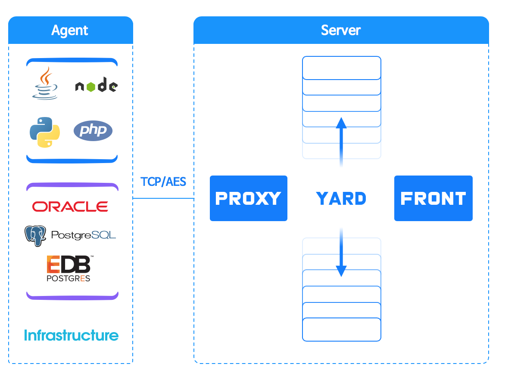

# 와탭 모니터링 소개

## 사업분야 {#user-content-사업분야}

모니터링 분야에 전념하고 있으며, 독보적인 모니터링 기술로 기존 모니터링 제품이 해결하지 못한 문제들을 해결하며 우수성을 인정 받고 있습니다.   
2016년에 한국 클라우드 서비스 품질 인증을 받아 퍼블릭 클라우드 모니터링 서비스를 운영 중이며, 운영중인 상용 솔루션을 고객 인프라에 구축도 가능합니다.

### 서비스 모니터링 {#user-content-서비스-모니터링}

### 구축형 모니터링 {#user-content-구축형-모니터링}

### 성능 컨설팅 {#user-content-성능-컨설팅}

## 제품 개요 {#user-content-제품-개요}

와탭은 Infrastructure\(서버\) 시스템과  Java, Node.js, PHP, Python Application\(APM\)과 데이터베이스의 성능을 모니터링하는 서비스 입니다.  클라우드 서비스 환경은 서버의 복잡도가 증가하고, 여러 개의 언어로 개발된 애플리케이션들이 혼재되어 서비스되는 경우가 빈번합니다. 이런 특징들을 효율적으로 대처하기 위해 인프라 모니터링과 랭귀지별 애플리케이션 모니터링 그리고 데이터베이스 모니터링으로 제품 라인업을 구성하고 있으며, 세가지 제품은 동일한 아키텍처에서 동작하도록 설계하였습니다.

### 통합 모니터링 구성 {#user-content-통합-모니터링-구성}

### 서비스 생명주기에 따른 모니터링 {#user-content-서비스-생명주기에-따른-모니터링}

와탭은 서비스의 생명 주기에 맞추어 3가지의 서비스를 제공합니다.

서비스 개발 및 테스트 그리고 서비스 오픈을 위한 퍼포먼스 체크에 필요한 Database Monitoring, Application Monitoring과 서비스 안정화 단계에서 서비스를 관리하기위해 사용하는 Infrastructure Monitoring 서비스를 제공합니다.

## 지원 플랫폼 {#user-content-지원-플랫폼}

Application Monitoring은 JAVA, NODE.JS, PHP, PYTHON 애플리케이션을 성능 관리합니다.  
Database Monitoring은 Oracle, MySQL, MS-SQL, Postgresql, EDB PAS, MariaDB에 대해서 모니터링 지원합니다.  
Infrastructure Monitoring은 전통적인 물리 서버 환경은 물론 다양한 클라우드 서버 환경도 모니터링 지원 합니다.

### Application 모니터링



**Operating System**  
HP.UX 11.x 32bit, 64bit, Itanium 64bit  
Oracle Solaris 2.8, 2.9, 10, 11 32bit, 64bit, x86  
Intel Linux 32bit, Redhat Itanium 64bit  
Microsoft Windows 2000, XP, 2003, 2008, 7, 8  
jdk1.6 설치가능한 모든 OS

**Application Server**  
Oracle WebLogic 9.x, 10.x, 11.x, 12.x  
Tmaxsoft JEUS 6.x, 7.x  
SUN Application Server 8.x, 9.x  
Fujitsu Interstage 5.x, 6.x, 7.x  
Hitachi Cosminexus 7.x, 8.x, 9.x  
Apache Jakarta Tomcat 5.x, 6.x, 7.x, 8.x   
Caucho Technology Resin 3.x, 4.x  
RedHat JBoss Application Server 6.x, 7.x  
GlassFish 3.x



**Operating Systems**   
windows, mac\(osx\), linux, ubuntu, centos 등 node.js 실행 환경 모두 지원

**WebServer**  
express.js , hapi.js, Mean.js, Koa.js 등의 node 기본 모듈 사용하는 전 framework

**Nodejs 버전**  
0.1.12 이상의 모든 버전

**Database**  
MySQL, MsSQL, MongoDB, redis 등



**Operating Systems**  
Centos/Redhat 6.x \(64bit\)이상  
Debian/Ubuntu 12.04 \(64bit\) 이상

**웹서버**  
Apache 및 PHP-FPM\(Nginx\)

**PHP 버전**  
PHP extension module로 동작  
5.2, 5.3, 5.4, 5.5, 5.6, 7.0, 7.1, zts\(Zend Thread Safe\) 지원 

**라이브러리**  
Mysql, Mysqli, PDO, cURL, MsSQL, Oracle\(Oci8\), PostgreSQL

**Database**   
Oracle, MySQL, MsSQL, MariaDB, PostgreSQL



**Operating Systems**  
Redhat/CentOS 6.x \(64bit\) 이상  
Debian/Ubuntu 12.04 \(64bit\) 이상

**Application**  
Django, bottle, cherrypy, flask, tornado

**Python 버전**  
2.7 & 3.3+

**지원 라이브러리**  
외부 호출:  httplib, requests, urllib   
디비 :  mysql, postgresql



### DataBase 모니터링



**Operating Systems**  
제한 없음  
  
**Oracle**  
Oracle 10g 이상



**Operating Systems**  
제한 없음

**PostgreSQL**  
Postgresql 9.2 이상  
EDB PAS 9.2 이상



**Operating Systems**   
제한 없음

**MySQL**  
MySQL 5.5 이상  
MariaDB 5.5 이상



**Operating Systems**   
제한 없음

**MS-SQL**  
SQL Server 2005 이상



### Infrastructure 모니터링



Windows Server 2008 R2 이상  
Windows XP 이상



**Cent OS / RedHat**  
CentOS\(5,6,7\) 및 RedHat   
Amazon AMI Linux 

**Ubuntu / Debian**   
Ubuntu 12.0.4 이상  
Debian 6.0 이상



## 차별성 {#user-content-차별성}

### 와탭 모니터링 구조

와탭 모니터링 솔루션은 에이전트와 수집 서버로 구성되며, 에이전트와 수집 서버간에는 보안을 위해 데이터를 암호화합니다. Application Monitoring, Database Monitoring, Infrastructure Monitoring은 플랫폼에 따라 에이전트는 구분되지만 하나의 수집서버에서 데이터를 관리하는 구조입니다.

### 대규모 모니터링을 위한 파일DB {#user-content-클라우드-환경을-고려한-확장구조}

와탭의 모니터링 수집서버는 대용량 데이터를 효율적으로 관리하기 위해 파일 DB를 자체 개발하여 사용하고 있습니다. 에이전트로 부터 수집된 실시간 데이터를 일 단위 데이터 파일로 저장하고, 사용자 접속 정보, 트랜잭션, 자원, 튜닝 정보를 5분단위/시간단위/일 단위로 데이터 파일로 구조화하여 저장합니다. 파일 형태로 데이터를 관리할 경우 RDB나 NoSQL을 사용하는 타사의 APM 서비스와는 비교 불가능한 퍼포먼스를 제공합니다.

> **파일 DB의 장점**  
> 빠른 데이터 조회 및 저장§물리 장애 시에도 데이터 문제 범위가 최소화\(일반 RDB 또는 Nosql 장애 시, 전체 데이터에 문제 발생\)  
> RDB, Nosql 대비 안정적이고 관리포인트가 적음

### Scalable & Stable 수집서버 아키텍처 {#user-content-클라우드-환경을-고려한-확장구조}

증가하는 관리\(모니터링\) 대상 서버를 원활히 수용하기 위해서는 모니터링 서버는 내부 확장성을 가져야 합니다. 확장성 보장을 위해 와탭 모니터링 서버는 세분화된 경량 서버 애플리케이션으로 구성되어 있으며, 결합도가 낮은 분산 환경입니다. 또한 데이터 안정성을 보장을 위해 이중화 및 데이터 복구 기능을 지원합니다.

> Agent는 Proxy 서버의 대표 IP를 바라보는 형태로 되어있어 수집 서버\(Yard\) 증설 시 별도의 에이전트 단 변화 없음 Proxy는 Single로 구성할 수도 있고 안정성을 위해 이중화 또는 삼중화 구성 가능

### 멀티 리전 지원 {#user-content-멀티-리전-지원}

멀티 존이나 리전이 생길 때마다 수집서버만 설치하고, 하나의 모니터링 화면에서 여러 리전의 서버를 통합 모니터링 합니다.  
그룹 계열사를 한 화면에서 모니터링 할 수 있습니다.

> IDC 센터 추가 구축 / 클라우드 플랫폼 추가 구축 등을 리전 구축만으로 데이터 손실/다운타임 없이 수집서버를 확장

### 멀티 테넌트 지원 {#user-content-멀티-테넌트-지원}

여러 회사의 시스템을 통합 모니터링하게 되면 한 사람의 관리자가 각 사용자의 권한 관계를 총괄할 수 없습니다.   
다중 사용자에 대한 관리수준이 권한 관리 수준을 넘어 테넌트 관리 수준이 되어야 합니다.  
멀티 테넌트 환경에서는 최상위 관리자라도 개별 시스템의 파라미터를 조회해서는 안됩니다.

> * 중앙 서비스 관리자가 직접 그룹 또는 프로젝트의 권한관리를 하지않고, 각 그룹 또는 프로젝트의 소유자가 권한을 관리
> * 그룹 또는 프로젝트에 관리자 여러명 지정 가능. 초대 기능 활용을 통해 관리자는 관리자 및 일반 사용자 초대/보기 권한 추가
> * 여러 개의 조직들의 통합 모니터링시 사이트 관리자 밑에 프로젝트 관리자와 일반 사용자를 설정

### 모니터링 대상 통합관리 {#user-content-확장-가능형-구조}

와탭 모니터링 서비스의 기본 목적은 자원\(인적, 물적\)의 공유입니다.  기존 제품은 모니터링 대상 별로 별도의 수집서버, 웹 화면을 구축해야 합니다.  
하지만 와탭의 모니터링 서비스는 수집서버는 공유하되, 각 서비스의 독립성을 지켜주는 구조입니다. 통합 관리를 하기 위해 모니터링 서버는 유연한 확장 구조여야 하고, 멀티 테넌트 기능을 제공해야 합니다.


* 각각의 수집서버마다 방화벽 작업을 별도로 진행
* 운영 인력 다수 필요



* 통합 수집서버의 대표 IP에만 방화벽 진입
* 운영 인력 리소스 최소화
* 관리 포인트 최소화


### 데이터 암호화 {#user-content-데이터-유실-방지}

에이전트와 서버는 바이너리 기반의 통신 프로토콜을 사용합니다. 또한 데이터를 선별적으로 암호화하여 데이터의 보안을 보장하면서도 암호화의 부담을 낮추었습니다. 모니터링 대상 서버에서는 Region의 대표 주소에 대한 방화벽을 오픈해야 합니다.

## 주요 고객 {#user-content-주요-고객}

## 서비스 소개

### 어플리케이션 모니터링

#### 주요기능 목록



실시간 트랜잭션 현황  
응답 시간 분포도\(Hitmap\)  
서버 현황  
Realtime User  
트랜잭션 현황  
리소스 현황



트랜잭션 프로파일링  
스택 분석  
멀티 트랜잭션 트레이스\(연계추적\)  
응답 시간 분포도 \(Hitmap\)  
SQL 추적   
HTTP Call 추적



Cube 분석  
스택 분석  
Performance Trend 분석  
응답 시간 분포도 \(Hitmap\)  
에러 통계



Transaction  
Error  
SQL  
Remote HTTP Call  
Client IP  
브라우저 통계



Agent 실행  방식  
개발/운영 환경 분리시 지원  
알람 설정  
알림 전달 수단 설정



Daily Report  
Daily Application Check  
Weekly Report  
Monthly Report



#### 대시보드

기본적으로 대시보드는 쉽고 빠르게 이해할 수 있어야 하므로 정보를 시각적으로 유지하는 것이 중요합니다.  
와탭 대시보드는 진행중인 트랜잭션과 종료된 트랜잭션 정보를 실시간으로 업데이트하고, 시각화된 차트를 제공하여 서비스 및 시스템의 정확한 현재 상태를 운용자에게 직관적으로 인지시킬 수 있습니다.

> * **진행중인 트랜잭션 분석 -** 종료되지 않은 트랜잭션을 실시간 모니터링
> * **종료된 트랜잭션 실시간 업데이트 -** 최신의 데이터 자동 업데이트 및 기간별 이력/통계 데이터 제공
> * **실시간 리소스 현황** - 한 눈에 볼 수 있는 실시간 TPS, 응답시간, CPU, Memory, User 정보 제공
> * **항상 최신 데이터 자동 업데이트 -** 최신의 데이터 자동 업데이트하여 실시간 모니터링 서비스 제공

#### 사용자 정의 대시보드

통합 대시보드를 구성하여 프로젝트들에 들어가는 정보들을 구성 및 커스터마이징 가능합니다.  
사용자 니즈에 따라 목적별로 대시 보드 화면을 구성합니다.

#### 아크 이퀄라이저

아크 이퀄라이저는 인스턴스 수만큼의 아크로 분할되어 진행중인 트랜잭션의 수를 보여줍니다. 아크를 클릭함으로 진행중인 트랜잭션의 상세정보를 확인할 수 있습니다.

#### 응답 시간 분포도\(Hit Map\)

개별 트랜잭션의 응답시간과 종료시간을 기준으로 전체 트랜잭션의 분포를 표현함으로 느린 트랜잭션에 대한 선택적 분석이 가능합니다.

> * X축: 시간 /  Y축: 트랜잭션 완료까지의 소요시간
> * 정상 트랜잭션: 청색 계열
> * 에러 트랜잭션: 적색 계열
> * 해당 시간대에 기록된 트랜잭션 밀도가 높을수록 짙은 색상\(하늘색 -&gt; 청색 / 노란색 -&gt; 적색\)

#### 스냅샷 분석

애플리케이션의 성능 문제를 해결하기 위해서는 메소드 레벨의 성능 분석이 필요합니다.   
일반적인 Static/Dynamic 트랜잭션 프로파일링 방법에서는 의심되는 메소드를 선별할 수 없는 한계가 있습니다.

> 애플리케이션의 성능 문제를 해결하기 위해서는 메소드 레벨의 성능 분석이 필요합니다.  
> 기존의 타사 트랜잭션 프로파일링 분석 방법에서는 의심되는 메소드를 선별할 수 없는 한계가 존재합니다.

와탭의 스냅샷 프로파일 분석은 10초 주기로 수집된 스택들을 통계화 하여 문제가 유발될 가능성 높은 부분을 자동으로 찾아줍니다.

#### 멀티 트랜잭션 연계 분석

 MSA 기반으로 프로젝트가 구성되어 있어도 프로젝트간 트랜잭션 연계 정보를 추적할 수 있습니다.

> Java, Node.js, Python 등 각각 다른 플랫폼으로 구성된 애플리케이션 서비스 트랜잭션 추적도 가능합니다.

#### 큐브 분석

시점별로 관련 성능 데이터를  한번에 조회해 볼 수 있는 기능입니다. Cube는 1일을 5분 구간으로 분할하여 288개의 Cube 단위 통계로 실시간 사용자, 국가별 접속, Hit Map 트랜잭션, TOP 트랜잭션, TPS, 응답 시간, 자원 사용 정보를 제공합니다.

#### 트렌드 분석

TPS, 응답시간, CPU 사용량, 트랜잭션 URL, SQL 등의 추세를 한눈에 파악할 수 있습니다. 애플리케이션의 최근 상태를 집약적으로 파악하는 데 최적화되었습니다.

#### 트랜잭션 분포 패턴 분석

와탭의 응답시간 분포도\(히트맵\)를 통해 종료된 트랜잭션의 상태를 체크할 수 있습니다.

> **히트맵**  
> 원하는 트랜잭션을 드래그하여 선택하면 해당 트랜잭션의 내용을 분석할 수 있습니다.
>
> **히트맵의 상태 분석**  
> 트랜잭션의 패턴을 분석하여 직관적으로 문제의 원인을 파악할 수 있습니다.
>
> **세로라인 경고**  
> 동시에 여러 트랜잭션들이 TimeOut 되면 세로라인패턴이 발생됩니다. 
>
> **가로라인 경고**  
> 동시에 여러 트랜잭션들에서 병목이 발생 되면 세로라인패턴이 발생됩니다. 
>
> _**와탭 모니터링은 이런 패턴을 인식하여 Email, SMS등으로 알림 경고를 발생합니다.**_

#### 통계 분석

트랜잭션 통계에서 개별 URL에 대한 일간 추 및 평균 응답 시간을 파악할 수 있고, 상세 프로파일 정보와 스택 분석을 통한 연관 분석이 가능합니다. 트랜잭션/SQL/HTTPCall에 대해서도 동일한 기능을 제공합니다.

#### 리포트

와탭은 Daily, Weekly, Monthly 리포트를 제공합니다. 특히 Monthly Report 에서는 MAU, DAU 정보를 제공하고 있어, 비지니스 지표로 활용할 수 있습니다. 또한 리포트들을 언제든지 출력 가능합니다.

#### 관리 기능

대규모 시스템을 운용하는 환경에서, 웹을 통해 간단한 조작만으로 전체 업데이트가 가능합니다.

사용자가 원하는 부가 정보를 획득하기 위해 플러그인 기능을 사용할 수 있습니다.  
예를 들어, 어떤 메소드의 파라미터를 추적하거나 Http Call에 추가정보\(Login id 등\)를 전송하는 목적으로 사용될 수 있습니다.

 주요 성능 지표를 Open API 을 통해 제공합니다. Auto Scale In/Out의 지표로 활용할 수 있습니다.

### 인프라 모니터링 {#user-content-인프라-모니터링-1}

#### 주요기능 목록

#### 컴파운드 아이

#### 서버 목록

#### 가용성 현황

#### 서버 단위 성능 추이 분석

#### 서버 프로세스 성능 추이 분석

#### 확장팩

#### 통합 이벤트 관리

#### 이력 관리

#### 알림 옵셜 설정

#### 프로세스 알림 설정

#### 알림 처리 프로세스

#### 담당자 내역 입력

### 데이터베이스 모니터링 {#user-content-데이터베이스-모니터링}

#### 주요 기능 목록

