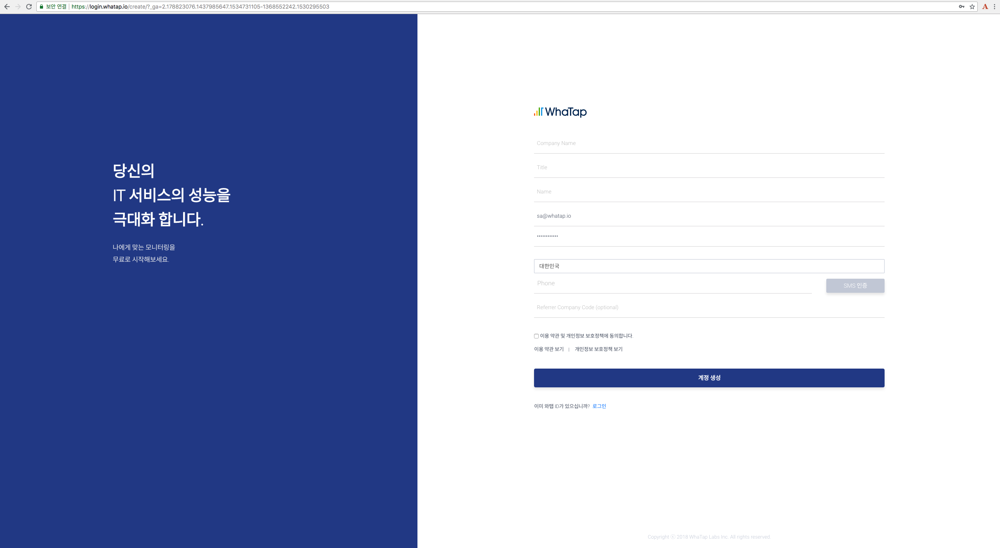

# 퀵스타트 가이드

## 공통 {#user-content-공통}

### 회원 가입 {#user-content-회원-가입}

1. 회사 계정, 회사 타이틀\(직급\), 이름, SMS 인증, 회사명, 비밀번호, 회사 참조 코드\(옵션\)을 입력하여 회원가입을 진행합니다.
2. 회원가입 완료 후 등록한 이메일로 가입 승인 안내 메일이 전송됩니다.
3. 이메일을 확인하여 가입승인을 완료하면 와탭 계정이 생성 됩니다

