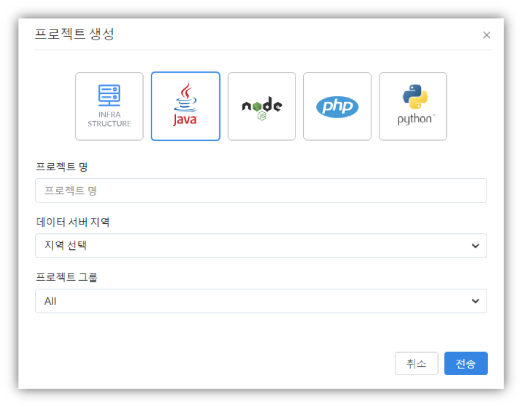

# Java

## Java 애플리케이션 모니터링 {#user-content-java-애플리케이션-모니터링}

### javaagent + onetime attach {#user-content-javaagent-onetime-attach}

본 가이드는 와탭 APM 모니터링의 3가지 설치 방식 중 “javaagent + onetime attach” 방식을 대상으로 합니다. “javaagent + onetime attach” 방식은 실행 중인 애플리케이션 서버에 와탭 APM 모니터링을 적용하고, 애플리케이션 서버 재기동 시 “javaagent” 방식으로 실행하고자 하는 경우에 적용하는 방식입니다. \(attach 방식으로 설치할 경우 일부 쿼리 데이터가 정상적으로 수집되지 않을 수 있습니다.\) ==== 설치 환경 설치 환경 구성

* OS: Linux
* 애플리케이션 서버: Tomcat
  * Tomcat이 아닌 다른 WAS의 JVM 옵션 추가 방법은 APM 콘솔 내 Management - 에이전트 설치 메뉴에서 확인할 수 있습니다
* 에이전트 설치 방식: “javaagent + onetime attach”

Windows에 진행하고 있다면 5장의 Java 애플리케이션 모니터링을 참조하세요.

**에이전트 구성 파일**

모니터링 정보를 수집하여 서버에 전송하기 위한 Tracer, Tracer를 실행 중인 애플리케이션 서버에 동적으로 적용하기 위한 attach 스크립트, 에이전트를 디버깅하기 위한 쉘 스크립트 파일로 구성됩니다.

와탭 모니터링 에이전트를 구성하는 각 파일의 역할은 다음과 같습니다.

| 파일명 | 설명 |
| :--- | :--- |
| whatap.agent.tracer-\#.\#.\#.jar | \(Tracer 프로그램\) 웹 애플리케이션 서버 프로세스에 Attach되어 정보를 수집하고 수집된 정보를 서버로 전송하는 프로그램 |
| whatap.conf | 애플리케이션 서버의 데이터를 수집하는 수집서버의 주소와 서버의 프로젝트 라이선스 키가 입력되는 파일 |
| javaproc.sh\(bat\) | 실행중인 자바 프로세스들의 PID와 JVM 옵션을 확인을 위한 쉘스크립트 |
| resmon.sh\(bat\) | CPU/Memory/Disk 정보 추출을 위한 쉘스크립트 |
| attach.sh\(bat\) | 실행 중인 애플리케이션 서버에 일회성으로 Tracer를 적용하기 위한 쉘스크립트 |

**에이전트 설치 절차**

와탭 APM 모니터링 서비스를 사용하기 위해서는 모니터링 대상 애플리케이션에 와탭 APM 모니터링 에이전트를 설치해야 합니다.

와탭 APM 모니터링 에이전트 설치 방법은 [www.whatap.io](http://www.whatap.io/) 사이트에서 압축된 에이전트 파일을 다운로드 받아 서버 임의의 위치에 압축을 풀어 실행하는 것만으로 설치가 완료됩니다.

**프로젝트 생성**


서버를 등록하기 위해 우선 프로젝트를 생성합니다. 추가 버튼을 선택하면 아래와 같이 프로젝트 생성 창이 나타납니다. Java 아이콘을 선택한 뒤, 희망하는 프로젝트명과 데이터 서버 지역\(Region\), 소속하게 될 그룹을 선택한 뒤 프로젝트를 생성합니다.



이후, 생성된 프로젝트를 클릭하여 관리 화면에 진입합니다

**라이선스 발급**


프로젝트 관리화면에서는 우선적으로 라이선스를 발급 받습니다. 라이선스 키는 프로젝트별로 귀속되기 때문에, 유출되거나 배포되어서는 안됩니다. 반드시 본인 프로젝트에 서버를 등록할 때에만 이용하시기 바랍니다.

**에이전트 다운로드**


라이선스를 발급 받은 후에는 ‘에이전트 파일 다운로드’ 버튼이 활성화 되었음을 확인할 수 있습니다. 해당 버튼을 눌러 와탭 에이전트 파일을 다운로드 받습니다.

다운로드가 완료되면 안에 있는 whatap.conf 파일의 설정을 확인하여 라이선스키와 데이터 수집 서버 주소가 정상적으로 들어가 있는지를 확인합니다.

```text
license={라이선스 키}
whatap.server.host={수집서버 정보}
```

* wget으로 직접 다운 받을 경우, whatap.conf 파일에 라이선스키와 데이터 수집 서버 주소가 정상적으로 들어가지 않습니다. 해당 방식으로 다운 받을 경우, 업로드 후 별도로 라이선스키와 데이터 수집 서버 주소를 넣어주시기 바랍니다.

**에이전트 업로드**

애플리케이션 서버가 설치된 서버에 접속하고, 다운로드 받은 에이전트 파일을 업로드 한 후, 압축해제를 합니다.

* $WHATAP\_HOME은 와탭 APM 모니터링 에이전트의 설치 경로를 가리키며, 이후 본 문서에서 이와 같이 기술합니다.
* 에이전트는 수집 서버 주소로 애플리케이션 서버의 성능 정보를 전송합니다. 그러므로 방화벽에 수집 서버 IP로의 TCP 아웃바운드 포트 \(6600\)이 차단되어 있으면 안됩니다.

**에이전트 설치**

실행 중인 애플리케이션 서버의 PID를 확인하기 위해 javaproc 스크립트를 실행합니다.

```bash
$ ./javaproc.sh
JAVA_HOME=/jdk1.7.0_79

  WhaTap Java Process Utility v1.0
  Copyright © 2016 WhaTap Labs Inc. All rights reserved.
    Pid    Application
  ------  -------------
    2583  org.apache.catalina.startup.Bootstrap start
  ------  -------------
 User: ec2-user
 Java Path: /jdk1.7.0_79/jre
 Java Version: 1.7.0_79
```

에이전트 적용’에서 진행하게 될 Attach 방식은 실행 중인 애플리케이션에만 적용이 되며, 애플리케이션 재실행시에는 적용되지 않기 때문에 재기동시 자동 설정을 위해서는 아래 코드를 적용해주어야 합니다. 애플리케이션 서버 JVM 옵션에 아래와 같은 -javaagent 설정을 추가합니다.

```text
-javaagent:{에이전트 설치 경로}/whatap.agent.tracer-#.#.#.jar
```

* 위 옵션은 javaagent 프로퍼티 값의 절대 경로 입니다.

항상 $WHATAP\_HOME 하위에 설치된 최상위 버전의 에이전트로 기동하고자 하는 경우, 하기의 스크립트를 참조하여 적용합니다.

```text
########## WHATAP ############
WHATAP_HOME=/whatap
WHATAP_JAR=`ls ${WHATAP_HOME}/whatap.agent.tracer-*.jar | sort | tail -1`
JAVA_OPTS=" -javaagent:${WHATAP_JAR} "
########## WHATAP ############
```

**에이전트 적용**

* 실행 중인 애플리케이션 서버에 모니터링을 적용하기 위해서 $WHATAP\_HOME 디렉토리에 있는 attach 스크립트를 실행하고 애플리케이션 서버 로그 및 에이전트 로그를 확인하여 에이전트의 정상 기동 여부를 확인합니다.

```text
$ ./attach.sh 2583
JAVA_HOME=/jdk1.7.0_79
 _      ____       ______
| | /| / / /  ___ /_  __/__ ____
| |/ |/ / _ \/ _ `// / / _ `/ _ \
|__/|__/_//_/\_,_//_/  \_,_/ .__/
                          /_/
Just Tap, Always Monitoring
WhaTap Agent version 0.4.5 20161207
Admin: ec2-user
PID: 2684
Java Path: /jdk1.7.0_79/jre
Java Version: 1.7.0_79

AttachAgent Success :  [2583] org.apache.catalina.startup.Bootstrap start
```

**모니터링 확인**


와탭 프로젝트로 돌아와 등록된 서버를 확인 합니다.


정상적으로 등록되어 있는지를 확인하기 위해서는 프로젝트 메뉴 좌측에 위치한 ‘서버’ 메뉴를 클릭하여 들어온 후, 해당 서버의 정보를 확인합니다. 해당 서버 우측의 More 메뉴의 Boot Environment 항목을 선택한 뒤 나오는 정보 중 whatap.name과 whatap.type 항목을 확인합니다.

* whatap.name - JVMP 메뉴 선택 시 표시되는 애플리케이션 목록의 애플리케이션에 표시되는 서버 식별용 명칭 포맷입니다.
* whatap.type - 애플리케이션 서버 종류가 표시됩니다.

### javaagent {#user-content-javaagent}

본 가이드는 와탭 APM 모니터링의 3가지 설치 방식 중 “javaagent” 방식을 대상으로 합니다. “javaagent” 방식은 애플리케이션 서버 실행 시점에 와탭 APM 모니터링을 적용하고자 하는 경우에 적용하는 방식입니다.

**설치 환경**

* OS: Linux
* 애플리케이션 서버: Tomcat
* 에이전트 설치 방식: “javaagent”
  * Windows에 설치를 진행하고 있다면 5장의 Java 애플리케이션 모니터링을 참조하세요.
  * Tomcat이 아닌 다른 WAS의 JVM 옵션 추가 방법은 APM 콘솔 내 Management – 에이전트 설치 메뉴에서 확인할 수 있습니다.

**에이전트 구성 파일**

모니터링 정보를 수집하여 서버에 전송하기 위한 Tracer와 에이전트를 디버깅하기 위한 쉘 스크립트 파일로 구성됩니다.

와탭 모니터링 에이전트를 구성하는 각 파일의 역할은 다음과 같습니다.

| 파일명 | 설명 |
| :--- | :--- |
| whatap.agent.tracer-\#.\#.\#.jar | \(Tracer 프로그램\) 웹 애플리케이션 서버 프로세스에 Attach되어 정보를 수집하고 수집된 정보를 서버로 전송하는 프로그램 |
| whatap.conf | 애플리케이션 서버의 데이터를 수집하는 수집서버의 주소와 서버의 프로젝트 라이선스 키가 입력되는 파일 |
| javaproc.sh\(bat\) | 실행중인 자바 프로세스들의 PID와 JVM 옵션을 확인을 위한 쉘스크립트 |
| resmon.sh\(bat\) | CPU/Memory/Disk 정보 추출을 위한 쉘스크립트 |

**에이전트 설치 절차**

와탭 APM 모니터링 서비스를 사용하기 위해서는 모니터링 대상 애플리케이션에 와탭 APM 모니터링 에이전트를 설치해야 합니다.

와탭 APM 모니터링 에이전트 설치 방법은 [www.whatap.io](http://www.whatap.io/) 사이트에서 압축된 에이전트 파일을 다운로드 받아 서버 임의의 위치에 압축을 풀어 실행하는 것만으로 설치가 완료됩니다.

**프로젝트 생성**


서버를 등록하기 위해 우선 프로젝트를 생성합니다. 추가 버튼을 선택하면 아래와 같이 프로젝트 생성 창이 나타납니다. Java 아이콘을 선택한 뒤, 희망하는 프로젝트명과 데이터 서버 지역\(Region\), 소속하게 될 그룹을 선택한 뒤 프로젝트를 생성합니다.


이후, 생성된 프로젝트를 클릭하여 관리 화면에 진입합니다

**라이선스 발급**


프로젝트 관리화면에서는 우선적으로 라이선스를 발급 받습니다. 라이선스 키는 프로젝트별로 귀속되기 때문에, 유출되거나 배포되어서는 안됩니다. 반드시 본인 프로젝트에 서버를 등록할 때에만 이용하시기 바랍니다.

**에이전트 다운로드**


라이선스를 발급 받은 후에는 ‘에이전트 파일 다운로드’ 버튼이 활성화 되었음을 확인할 수 있습니다. 해당 버튼을 눌러 와탭 에이전트 파일을 다운로드 받습니다.

다운로드가 완료되면 안에 있는 whatap.conf 파일의 설정을 확인하여 라이선스키와 데이터 수집 서버 주소가 정상적으로 들어가 있는지를 확인합니다.

```text
license={라이선스 키}
whatap.server.host={수집서버 정보}
```

* wget으로 직접 다운 받을 경우, whatap.conf 파일에 라이선스키와 데이터 수집 서버 주소가 정상적으로 들어가지 않습니다. 해당 방식으로 다운 받을 경우, 업로드 후 별도로 라이선스키와 데이터 수집 서버 주소를 넣어주시기 바랍니다.

**에이전트 업로드**

애플리케이션 서버가 설치된 서버에 접속하고, 다운로드 받은 에이전트 파일을 업로드 한 후, 압축해제를 합니다.

* $WHATAP\_HOME은 와탭 APM 모니터링 에이전트의 설치 경로를 가리키며, 이후 본 문서에서 이와 같이 기술합니다.
* 에이전트는 수집 서버 주소로 애플리케이션 서버의 성능 정보를 전송합니다. 그러므로 방화벽에 수집 서버 IP로의 TCP 아웃바운드 포트 \(6600\)이 차단되어 있으면 안됩니다.

**에이전트 설치**

애플리케이션 서버 JVM 옵션에 아래와 같은 -javaagent 설정을 추가합니다.

```text
-javaagent:[에이전트 설치 절대 경로]/whatap.agent.tracer-#.#.#.jar
```

* 위 옵션은 javaagent 프로퍼티 값의 절대 경로 입니다.

항상 $WHATAP\_HOME 하위에 설치된 최상위 버전의 에이전트로 기동하고자 하는 경우, 하기의 스크립트를 참조하여 적용합니다.

```text
########## WHATAP ############
WHATAP_HOME=/whatap
WHATAP_JAR=`ls ${WHATAP_HOME}/whatap.agent.tracer-*.jar | sort | tail -1`
JAVA_OPTS=" -javaagent:${WHATAP_JAR} "
########## WHATAP ############
```

**애플리케이션 재기동**

애플리케이션 서버를 기동 또는 재기동 한 뒤, 애플리케이션 서버 로그 및 에이전트 로그를 확인하여 에이전트의 정상 기동 여부를 확인합니다.

```text
Nov 16, 2016 3:06:40 AM org.apache.catalina.startup.HostConfig deployDirectory
INFO: Deployment of web application directory /var/lib/tomcat7/webapps/ROOT has finished in 577 ms
Nov 16, 2016 3:06:40 AM org.apache.coyote.AbstractProtocol start
INFO: Starting ProtocolHandler ["http-bio-8080"]
Nov 16, 2016 3:06:40 AM org.apache.catalina.startup.Catalina start
INFO: Server startup in 3984 ms

_      ____       ______
| | /| / / /  ___ /_  __/__ ____
| |/ |/ / _ \/ _ `// / / _ `/ _ \
|__/|__/_//_/\_,_//_/  \_,_/ .__/
                          /_/
Just Tap, Always Monitoring
WhaTap Agent version 0.3.9 20161115
```

**모니터링 확인**


와탭 프로젝트로 돌아와 등록된 서버를 확인 합니다.


정상적으로 등록되어 있는지를 확인하기 위해서는 프로젝트 메뉴 좌측에 위치한 ‘서버’ 메뉴를 클릭하여 들어온 후, 해당 서버의 정보를 확인합니다. 해당 서버 우측의 더보기 메뉴의 부트 환경 항목을 선택한 뒤 나오는 정보 중 whatap.name과 whatap.type 항목을 확인합니다.

* whatap.name - JVMP 메뉴 선택 시 표시되는 애플리케이션 서버 목록의 애플리케이션에 표시되는 서버 식별용 명칭 포맷입니다.
* whatap.type - 애플리케이션 서버 종류가 표시됩니다.

