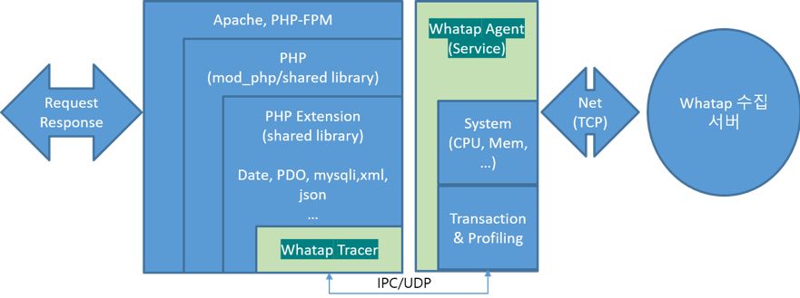
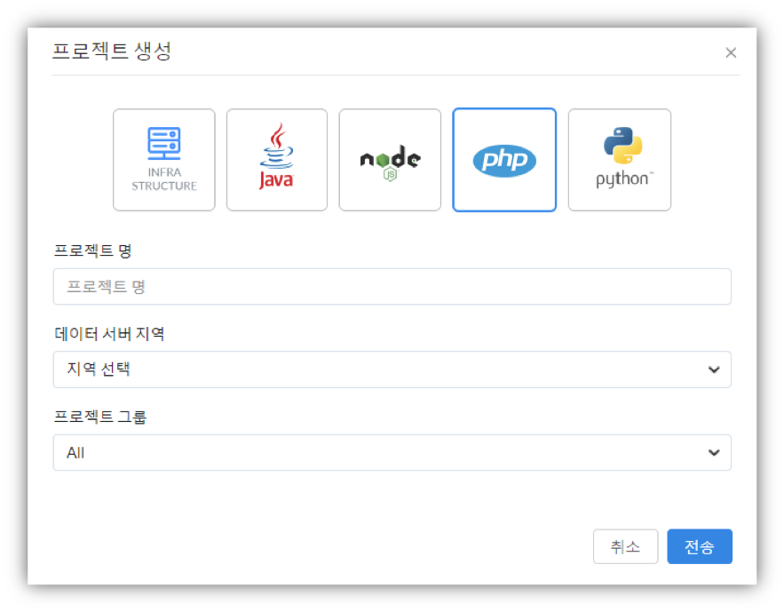
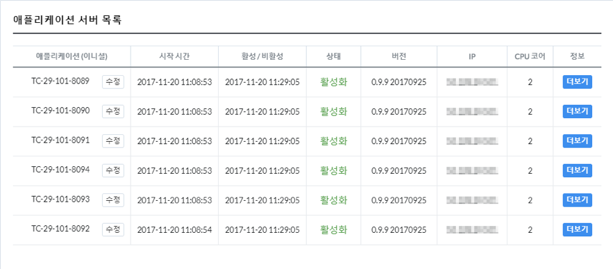
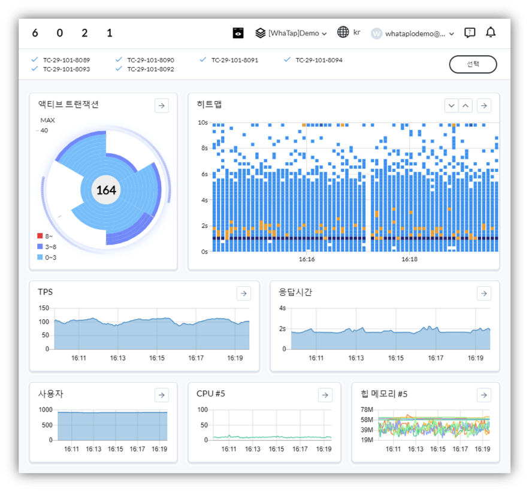

# PHP

본 가이드는 사용자가 와탭 PHP 모니터링 서비스를 사용 중인 PHP 애플리케이션 서버에 설치하고 확인하는 내용을 다룹니다. 별도의 세부적인 설정을 필요로 하는 프레임워크/옵션을 사용하는 경우 설치 가이드를 참고해주시기 바랍니다. 



PHP 모니터링 서비스를 사용하기 위해서는 모니터링 대상 애플리케이션에 모니터링 에이전트를 설치해야 합니다.

* 와탭 저장소\(Repository\)를 설치합니다.
* whatap-php 리눅스 패키지를\(yum, apt-get\) 설치합니다.
* 설정 스크립트를 실행합니다.
* Apache 또는 PHP-FRPM을 재시작 합니다.

설정 스크립트를 통해서 트레이서는 PHP 확장 모듈\(PHP Extension module\)로 등록되고, 에이전트는 whatap-php 서비스\(Service\)로 실행됩니다.

## 지원 환경 {#user-content-지원-환경}

* OS : RedHat / CentOS 64bit 6.x 이상, Ubuntu 64bit 12.04 이상
* PHP: 5.2, 5.3, 5.4, 5.5, 5.6, 7.0, 7.1, ZTS\(Zend Thread Safe\)
* Library: mysql, mysqli, PDO, cURL, Oracle\(oci8\), Mssql
* Network : 외부 와탭 서버 연결 포트 6600, 내부 UDP 포트 6600

## 에이전트 구성 파일 {#user-content-에이전트-구성-파일-2}

모니터링 정보를 수집하기 위한 트레이서, 수집된 정보를 서버에 전송하기 위한 에이전트, 트레이서와 에이전트를 서버에 동적으로 적용하기 위한 설치 스크립트 파일로 구성됩니다.

PHP 모니터링 서비스를 구성하는 각 파일의 역할은 다음과 같습니다.

| 파일명 | 설명 |
| :--- | :--- |
| whatap\_\#\_\#.so | 트레이서 PHP 확장 모듈\(PHP Extension module\)로 추가 되어 정보를 수집하고 수집된 정보를 에이전트로 전송하는 라이브러리입니다. |
| whatap-php\(whatap\_php\) | 에이전트, 트레이서에서 UDP로 전달된 정보를 수집서버로 전송하는 프로그램입니다. |
| /etc/init.d/whatap-php | 서비스 스크립트 |
| whatap\_php | 서비스 실행파일 |
| whatap.ini | 애플리케이션 서버의 데이터를 수집하는 PHP 확장 모듈\(PHP Extension module\)의 설정 정보, 수집서버의 주소와 서버의 프로젝트 라이선스 키가 입력되는 파일입니다. |
| whatap-install-\#.log | 설치 과정에 대한 로그 파일입니다. \(/usr/whata/php/logs\) |
| whatap-boot-\#.log | 에이전트 로그 파일 입니다. \(/usr/whata/php/logs\) |
| install.sh | 웹 애플리케이션 서버에 트레이서를 적용하기 위한 쉘 스크립트입니다. |
| Whatap.php | \(sample.php\) PHP 소스코드에서 사용할 API 레퍼런스 클래스 \(/usr/whatap/php/lib/Whatap.php\) 및 예제 소스 파일\(sample.php\) 입니다. |

## 에이전트 설치 절차 {#user-content-에이전트-설치-절차-2}

### **프로젝트 생성**


서버를 등록하기 위해 우선 프로젝트를 생성합니다. 추가 버튼을 선택하면 아래와 같이 프로젝트 생성 창이 나타납니다. Java 아이콘을 선택한 뒤, 희망하는 프로젝트명과 데이터 서버 지역\(Region\), 소속하게 될 그룹을 선택한 뒤 프로젝트를 생성합니다.



이후, 생성된 프로젝트를 클릭하여 관리 화면에 진입합니다

### **라이선스 발급**


프로젝트 관리화면에서는 우선적으로 라이선스를 발급 받습니다. 라이선스 키는 프로젝트별로 귀속되기 때문에, 유출되거나 배포되어서는 안됩니다. 반드시 본인 프로젝트에 서버를 등록할 때에만 이용하시기 바랍니다. 하나의 라이선스 키\(프로젝트\)에 여러 개의 서버를 등록할 수 있습니다.

### **에이전트 설치**

#### **RedHat/CentOS**

**패키지 저장소\(Repository\) 등록**

```text
$ sudo rpm -Uvh http://repo.whatap.io/centos/5/noarch/whatap-repo-1.0-1.noarch.rpm
```

**패키지 설치**

```text
$ sudo yum install whatap-php
```

**PHP 확장 모듈\(PHP Extension module\) 및 whatap-php 서비스\(Service\) 등록**

PHP 확장 모듈\(PHP Extension module\) 및 whatap-php 서비스\(Service\)를 자동으로 설치할 경우에 아래와 같이 적용합니다

```text
$ sudo /usr/whatap/php/install.sh

Input license key
xxxxxxxxxxxxxxxx                          # 발급된 라이선스 key 입력

Input whatap.server.host
192.x.x.x                                  # 발급된 서버 IP 입력
```

PHP 확장 모듈\(PHP Extension module\) 및 whatap-php 서비스\(Service\)를 자동으로 인식하지 못하는 경우 아래와 같이 선택 설치를 진행해야 합니다. 주로 Apache 명령어\(apachectl, httpd, apache2\) 및 PHP 명령어\(CLI\)가 기본 경로\($PATH\)에 설정 되어 있지 않거나, 여러 개의 PHP가 설치되어 PHP 명령어\(CLI\)가 여러 개일 경우에 \(php5, php70, php-zts, zts-php…\) 실제로 적용하고 있는 버전을 선택하여 진행합니다.

```text
$ sudo /usr/whatap/php/install.sh manual

Input license key
xxxxxxxxxxxxxxxx                            # 발급된 라이선스 key 입력]

Input whatap.server.host
192.x.x.x                                    # 발급된 서버 IP 입력]

Input : which apache or php-fpm ex)/usr/sbin/httpd, /usr/sbin/apache2, /usr/sbin/php-fpm ...
/usr/sbin/httpd                             # apache 및 php-fpm 명령어 위치 입력

Input : which php ex) /usr/bin/php, /usr/bin/php5, /usr/bin/php70 ...
/usr/bin/php5                               # php 명령어 위치 입력
```

#### **Debian/Ubuntu**

**패키지 저장소\(Repository\) 등록**

```text
$ wget http://repo.whatap.io/debian/release.gpg -O -|sudo apt-key add -
$ wget http://repo.whatap.io/debian/whatap-repo_1.0_all.deb
$ sudo dpkg -i whatap-repo_1.0_all.deb
$ sudo apt-get update
```

**패키지 설치**

```text
$ sudo apt-get install whatap-php
```

**PHP 확장 모듈\(PHP Extension module\) 및 whatap-php 서비스\(Service\) 등록**

PHP 환경을 동적으로 확인하여 설치합니다.

```text
$ sudo /usr/whatap/php/install.sh

Input license key
xxxxxxxxxxxxxxxx                              # 발급된 라이선스 key 입력

Input whatap.server.host
192.x.x.x                                      # 발급된 서버 IP 입력
```

PHP 확장 모듈\(PHP Extension module\) 및 whatap-php 서비스\(Service\)를 자동으로 인식하지 못하는 경우 아래와 같이 선택 설치를 진행해야 합니다. 주로 Apache 명령어\(apachectl, httpd, apache2\) 및 PHP 명령어\(CLI\)가 기본 경로\($PATH\)에 설정 되어 있지 않거나, 여러 개의 PHP가 설치되어 PHP 명령어\(CLI\)가 여러 개일 경우에 \(php5, php70, php-zts, zts-php…\) 실제로 적용하고 있는 버전을 선택하여 진행합니다.

```text
$ sudo /usr/whatap/php/install.sh manual

Input license key
xxxxxxxxxxxxxxxx                              # 발급된 라이선스 key 입력

Input whatap.server.host
192.x.x.x                                      # 발급된 서버 IP 입력

Input : which apache or php-fpm ex)/usr/sbin/httpd, /usr/sbin/apache2, /usr/sbin/php-fpm ...
/usr/sbin/httpd                              # apache 및 php-fpm 명령어 위치 입력

Input : which php ex) /usr/bin/php, /usr/bin/php5, /usr/bin/php70 ...
/usr/bin/php5                                # php 명령어 위치 입력
```

### **애플리케이션 재기동**

설치가 완료된 후 Apache 서비스 또는 PHP-FPM을 재시작 합니다.

### **로그 확인**

애플리케이션 서버를 기동 또는 재기동 한 뒤, 애플리케이션 서버 로그 및 에이전트 로그를 확인하여 에이전트의 정상 기동 여부를 확인합니다.apache/error\_log

```text
[Fri Nov 24 11:13:03 2017] [notice] Apache/2.2.15 (Unix) DAV/2 PHP/5.4.45 configured -- resuming normal operations
[Fri Nov 24 15:24:09 2017] [notice] caught SIGTERM, shutting down
[Fri Nov 24 15:24:09 2017] [notice] suEXEC mechanism enabled (wrapper: /usr/sbin/suexec)
[Fri Nov 24 15:24:09 2017] [notice] Digest: generating secret for digest authentication ...
[Fri Nov 24 15:24:09 2017] [notice] Digest: done
WA001 Whatap APM started
```

/usr/whatap/php/logs/whatap-boot-xxx.log

```text
2017/11/27 15:49:15 [WA214] Config: /etc/php.d/whatap.ini
2017/11/27 15:49:15
2017/11/27 15:49:15 ## OPEN LOG FILE  boot  0.3.0.20170929   20171127 06:49:15.44 ##
2017/11/27 15:49:15
2017/11/27 15:49:15 [WA827] 0xc4204ba460
2017/11/27 15:49:15 [WA214] Config: /etc/php.d/whatap.ini
2017/11/27 15:49:15 [WA171] PCODE=1234569399OID=-1182161871ONAME=d54FPHP-3-15-httpd
2017/11/27 15:49:15 [WA174] Net TCP: Connect to121.134.69.246:6600
2017/11/27 15:49:16 [WA632] Net UDP: Try to.... localhost:6600
2017/11/27 15:49:16 [WA635] Net UDP: Listener localhost:6600
```

### **모니터링 확인**



에이전트가 정상적으로 등록되면 SERVERS메뉴에서 등록된 에이전트를 확인할 수 있습니다. 애플리케이션 이름은 에이전트 설치시에 설정하였던 app\_name과 pp\_process\_name옵션 그리고 수집한 IP를 조합하여 사용합니다. 각각의 애플리케이션 서버 우측 위치한 More 버튼을 통해 에이전트의 부팅정보, 환경정보에 대한 상세한 내용을 조회할 수 있습니다. 

설정안내 참고: [http://www.whatap.io/document/guide/WHATAP\_REFERENCE\_PHP.pdf](http://www.whatap.io/document/guide/WHATAP_REFERENCE_PHP.pdf) 

에이전트의 데이터를 수집 상태는 대시보드 페이지에서 실시간으로 확인할 수 있습니다.

* 데이터 수집 주기는 5초입니다.

